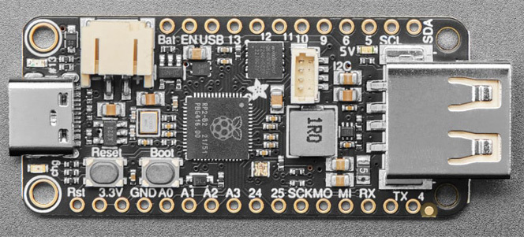

# adafruit-feather-rp2040-host-midi2: example for the [midi2_cpp](../..) library

USB MIDI 2.0 **host** example for the **Adafruit Feather RP2040 USB Host**. Plugs the upstream device into the USB-A port (PIO-USB on GP16/GP17), routes UMP through `m2host`, and renders device topology + live UMP stream on a 128x64 SSD1306 OLED over I2C1 (STEMMA QT). Lives at `midi2_cpp/examples/adafruit-feather-rp2040-host-midi2/` and consumes the parent library directly (no vendoring).



> ⚠️ **TinyUSB override, not yet upstream.** The USB MIDI 2.0 host class driver this project depends on lives in TinyUSB [PR #3571](https://github.com/hathach/tinyusb/pull/3571), still under review. Until that PR merges into `hathach/tinyusb`, this build pulls a personal fork ([`sauloverissimo/tinyusb` branch `feat/midi2-device-host-driver`](https://github.com/sauloverissimo/tinyusb/tree/feat/midi2-device-host-driver)) at a pinned SHA. Treat the build as **beta**: when the PR lands upstream the override goes away and this README will point at the official TinyUSB.

## What this is

`adafruit-feather-rp2040-host-midi2` is the platform layer for a MIDI 2.0 host on the Adafruit Feather RP2040 USB Host. It owns:

- Pico SDK board init (`board_init`), USB-A 5V power gate (GP18), PIO-USB host (`tusb_init`)
- TinyUSB MIDI 2.0 host class wiring (override of TinyUSB **PR #3571 fork**, *not yet merged upstream*, fetched on demand via CMake FetchContent + Pico-PIO-USB)
- The five [midi2_cpp](https://github.com/sauloverissimo/midi2_cpp) platform hooks already wired into `m2host`: `setWriteFn`, `feedRx`, `setNowFn`, `setMounted`, `setRngFn`
- Auto-discovery on mount: UMP Stream Endpoint Discovery + MIDI-CI Discovery Inquiry fired without app code, then `DeviceIdentity` populated as replies arrive
- Multi-device addressing by `idx`. Up to `MIDI2_CPP_HOST_MAX_DEVICES` (default 4) connected MIDI 2.0 devices simultaneously

After `feather_host::init(midi)`, the application sees only `m2host`. It never touches `tuh_*`, `pico_*`, or any USB symbol. Replicating the same shape on another host board is a matter of writing `<board>_host.{h,cpp}` with the same two-function surface.

## What this is not

Not a finished product. The bundled `adafruit-feather-rp2040-host-midi2-showcase` executable is a **demo application** that renders identity + decoded UMP traffic on a 128x64 SSD1306 OLED (I2C1, STEMMA QT). Real applications copy this core and replace the showcase with their own behaviour layer:

- **Bridge**: host on USB-A, device on USB-C, forward UMP between them. See [`adafruit-feather-rp2040-bridge-midi2`](../adafruit-feather-rp2040-bridge-midi2).
- **Logger**: capture every UMP to flash for offline analysis.
- *(your project here)*

## Identification

Host's own MIDI-CI Initiator identity:

| Field | Value |
|---|---|
| MIDI-CI Manufacturer ID | `{0x7D, 0x00, 0x00}` (MIDI Association educational/non-commercial prefix) |
| MIDI-CI Family / Model / Version | `0x0001 / 0x0001 / 0x00010000` |
| Host MUID | seeded on `begin()` from `pico_rand`'s `get_rand_32`, masked to 28 bits |

The host has its own identity because it is the **CI Initiator**: it sends Discovery Inquiry to plugged-in devices and stores their Discovery Reply MUIDs in `m2host::identity(idx).ciMuid`.

## Build

Requirements:

- **Pico SDK 2.x** with `PICO_SDK_PATH` exported
- **arm-none-eabi-gcc** toolchain (Arm GNU embedded, 9+ recommended)
- **CMake 3.14+**
- Internet on the first `cmake -B build` (FetchContent pulls TinyUSB fork + Pico-PIO-USB)

```bash
git clone https://github.com/sauloverissimo/midi2_cpp.git
cd midi2_cpp/examples/adafruit-feather-rp2040-host-midi2
cmake -B build         # first run fetches deps (~5 MB TinyUSB + ~1 MB Pico-PIO-USB)
cmake --build build -j # offline from here on
```

Flash the resulting `build/adafruit-feather-rp2040-host-midi2-showcase.uf2` onto the Feather in BOOTSEL mode (drag-and-drop or `picotool load`).

To use a local fork or working copy on disk:

```bash
cmake -B build \
  -DPICO_TINYUSB_PATH=/path/to/your/tinyusb \
  -DPICO_PIO_USB_PATH=/path/to/your/Pico-PIO-USB
```

## Hardware

| Pin | Use |
|---|---|
| GP16 | USB-A D+ (PIO-USB) |
| GP17 | USB-A D- (PIO-USB) |
| GP18 | USB-A 5V power gate (driven high in `feather_host::init`) |
| GP2  | I2C1 SDA (STEMMA QT, SSD1306 0x3C) |
| GP3  | I2C1 SCL (STEMMA QT, SSD1306 0x3C) |
| GP0  | UART TX (debug print @ 115200 8N1) |
| GP1  | UART RX |
| USB-C | programming + power (CDC stdio disabled, UART only) |

| Component | Use |
|---|---|
| Adafruit Feather RP2040 USB Host | RP2040 + USB-A host port via PIO-USB |
| 128x64 SSD1306 OLED (I2C 0x3C) | live display, on STEMMA QT |
| Upstream MIDI 2.0 device | the device under test (e.g. our [`rp2040-midi2`](../rp2040-midi2)) |

## Showcase

What the bundled `adafruit-feather-rp2040-host-midi2-showcase` executable demonstrates:

**Always-on (boot to forever):**

- **Splash** (1.5 s on boot) with title and BETA hint
- **Spinner** while no MIDI 2.0 device is plugged in
- **Auto-discovery** on mount: UMP Stream Endpoint Discovery + MIDI-CI Discovery Inquiry fire without app code
- **CI Initiator role**: host transmits Discovery Inquiry, replies populate `m2host::identity(idx)`
- **Live decoded UMP** on the OLED with idx prefix, color-coded per category

**Per device (when mounted):**

| Event | OLED line |
|---|---|
| Mount | `[N] MIDI 2.0` (or `MIDI 1.0` based on `bcdMSC`) |
| Endpoint Name notification | `[N] name: <product>` |
| NoteOn | `[N] On <note> ch<n> v<vel16>` |
| NoteOff | `[N] Off <note> ch<n>` |
| CC (32-bit) | `[N] CC<idx> ch<n> <val32>` |
| Pitch Bend | `[N] PB ch<n> <val32>` |
| Per-Note Pitch Bend | `[N] PNPB <note> ch<n> <val32>` |
| JR Timestamp | `[N] JR-TS <ts16>` |
| Disconnect | `[N] disconnected` |

UART debug on GP0 mirrors most events for headless monitoring.

## Validation

Plug the device-side example we ship, [`rp2040-midi2`](../rp2040-midi2), into the Feather's USB-A port. The 22 s cycle of that device emits every category of UMP MIDI 2.0 brings beyond MIDI 1.0 (Flex Data, Per-Note expression, 16-bit velocity walk, 32-bit CC sweep, Program+Bank, RPN/NRPN/Relative, Note Attribute pitch_7_9, SysEx8, Delta Clockstamp, PE Notify, JR Heartbeat). Each of those should appear decoded on the host's OLED in real time, proving the round trip works end-to-end at the wire level.

## Hot-swap caveat

In production hardware testing on RP2040, the TinyUSB host stack can occasionally get stuck after a device is unplugged and fail to re-enumerate on re-plug. A 3 s watchdog in `feather_host::task` works around this: when `deviceCount()` drops to zero and stays there for 3 s after we previously had a device, the host stack is reset (`tuh_deinit` + `tusb_init`). The watchdog is on by default and can be tuned at compile time:

```bash
cmake -B build -DMIDI2_CPP_HOST_WATCHDOG_MS=5000   # tune to 5 s
cmake -B build -DMIDI2_CPP_HOST_WATCHDOG_MS=0      # disable
```

## What lives where

```
midi2_cpp/
├── src/                            parent library (consumed by this example
│                                   via ../../src in this CMakeLists)
└── examples/adafruit-feather-rp2040-host-midi2/
    ├── CMakeLists.txt              FetchContent for TinyUSB PR #3571 + Pico-PIO-USB
    ├── pico_sdk_import.cmake
    ├── README.md
    ├── board/
    │   ├── banner.png              repo banner (used in this README)
    │   └── rp2040-feather-host-pinout.png   Feather RP2040 USB Host GPIO reference
    └── src/
        ├── feather_host.{h,cpp}    PIO-USB + TinyUSB glue, m2host hooks
        ├── tusb_config.h           CFG_TUH_RPI_PIO_USB=1, CFG_TUH_MIDI2=1
        ├── display.{h,c}           SSD1306 driver (128x64, I2C, 6-line log + status)
        ├── font5x7.h               5x7 ASCII bitmap font
        └── main.cpp                showcase entry, m2host callbacks → display_log
```

The TinyUSB PR #3571 fork and Pico-PIO-USB are fetched at configure time into `build/_deps/` (gitignored). This example folder itself is ~1 MB.

## License

MIT, inherits the parent [`midi2_cpp` LICENSE](../../LICENSE). The TinyUSB fork (fetched on demand) is MIT (upstream by hathach, fork by sauloverissimo carrying the MIDI 2.0 class drivers from the still-open [PR #3571](https://github.com/hathach/tinyusb/pull/3571)). Pico-PIO-USB is MIT.
