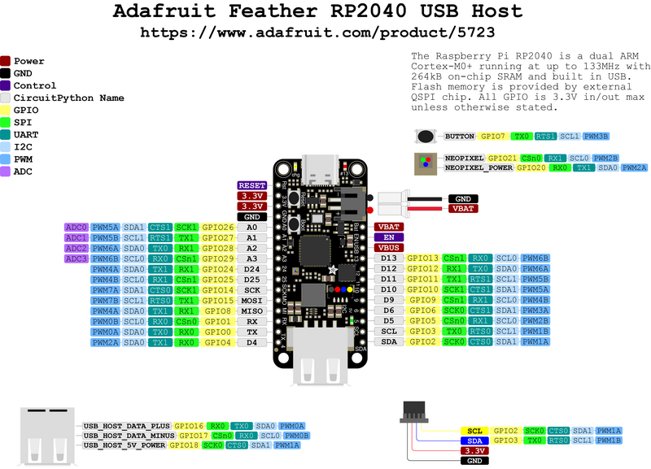

# [midi2cpp](../..) | Host MIDI 2.0
## Adafruit Feather RP2040 USB Host

USB MIDI 2.0 host on the **Adafruit Feather RP2040 USB Host**. Plug an upstream MIDI 2.0 device into the USB-A port (PIO-USB on GP16 / GP17), routes UMP through `m2host`, renders device topology + live UMP stream on a 128x64 SSD1306 OLED over I2C1 (STEMMA QT). Pico SDK build, no Arduino IDE.



> Depends on TinyUSB [PR #3571](https://github.com/hathach/tinyusb/pull/3571). Until merged, the build pulls a pinned fork via FetchContent.

## USB identity

Host-only role: no USB VID / PID consumed. The host plays MIDI-CI **Initiator**: it transmits Discovery Inquiry on every device mount and stores remote MUIDs in `m2host::identity(idx).ciMuid`.

| Field | Value |
|---|---|
| MIDI-CI Manufacturer ID | `{0x7D, 0x00, 0x00}` |
| MIDI-CI Family / Model / Version | `0x0001 / 0x0001 / 0x00010000` |
| Host MUID | seeded at boot from `pico_rand`'s `get_rand_32`, masked to 28 bits |

## Build

Requires Pico SDK 2.x (with `PICO_SDK_PATH` exported), `arm-none-eabi-gcc`, CMake 3.14+.

```bash
cmake -B build         # first run fetches TinyUSB fork + Pico-PIO-USB
cmake --build build -j
```

Pointing at local checkouts: `cmake -B build -DPICO_TINYUSB_PATH=/path/to/tinyusb -DPICO_PIO_USB_PATH=/path/to/Pico-PIO-USB`.

## Flash

Hold BOOTSEL on the Feather, plug USB-C, drag `build/adafruit-feather-rp2040-host-midi2-showcase.uf2` to the mounted `RPI-RP2` drive. Or `picotool load build/adafruit-feather-rp2040-host-midi2-showcase.uf2 -fx`.

## Hardware


| Pin | Use |
|---|---|
| USB-A jack | Host A-side (PIO-USB on GP16 D+ / GP17 D-, 5V power gate on GP18 driven HIGH at init) |
| USB-C | Programming + power (CDC stdio disabled, UART only) |
| GP2 / GP3 | I2C1 SDA / SCL (SSD1306 0x3C on STEMMA QT) |
| GP0 / GP1 | UART TX / RX debug print @ 115200 8N1 |

| Component | Use |
|---|---|
| 128x64 SSD1306 OLED | Live decoded UMP, on STEMMA QT (I2C 0x3C) |
| Upstream MIDI 2.0 device | Plugged into the USB-A jack |

## Validation

Plug any USB MIDI 2.0 device (full-spec showcase, Daisy Seed with MIDI 2.0 firmware, Teensy native MIDI 2.0, etc.) into the USB-A jack. The OLED should print `[N] MIDI 2.0` on mount, the device's Endpoint Name on Discovery reply, and decoded UMP events as the device emits them. UART debug on GP0 mirrors most events for headless monitoring.


## Spec coverage

**Tier A** host. The RP2040's 264 KB SRAM affords up to `MIDI2CPP_HOST_MAX_DEVICES` (default 4) connected MIDI 2.0 devices simultaneously, addressed by `idx`.

| UMP MT | Direction | Spec | Notes |
|---|---|---|---|
| 0x0 Utility | RX | M2-104-UM §3 | JR Timestamp tracked, surfaced on the OLED |
| 0x4 MIDI 2.0 Channel Voice | RX | M2-104-UM §7 | NoteOn/Off (16-bit velocity), CC (32-bit), Pitch Bend (32-bit), Per-Note Pitch Bend (32-bit) |
| 0xF UMP Stream | RX | M2-104-UM §11 | full Endpoint + FB Discovery, Endpoint Name notification surfaced on the OLED |

MIDI-CI: Discovery Initiator only (auto-fired on mount). Replies populate `m2host::identity(idx).ciMuid`.

## Showcase

On boot: 1.5 s splash + BETA hint, then spinner while no device is plugged. Auto-discovery fires UMP Stream + MIDI-CI Discovery Inquiry on mount without app code.

Per device, the OLED displays one event per UMP packet:

| Event | OLED line |
|---|---|
| Mount | `[N] MIDI 2.0` (or `MIDI 1.0` based on `bcdMSC`) |
| Endpoint Name notification | `[N] name: <product>` |
| NoteOn | `[N] On <note> ch<n> v<vel16>` |
| NoteOff | `[N] Off <note> ch<n>` |
| CC (32-bit) | `[N] CC<idx> ch<n> <val32>` |
| Pitch Bend | `[N] PB ch<n> <val32>` |
| Per-Note Pitch Bend | `[N] PNPB <note> ch<n> <val32>` |
| JR Timestamp | `[N] JR-TS <ts16>` |
| Disconnect | `[N] disconnected` |

UART debug on GP0 mirrors most events for headless monitoring.

## Hot-swap caveat

A 3 s watchdog in `feather_host::task` resets the TinyUSB host stack (`tuh_deinit` + `tusb_init`) when `deviceCount()` drops to zero and stays there for 3 s. Tune at compile time:

```bash
cmake -B build -DMIDI2CPP_HOST_WATCHDOG_MS=5000   # 5 s
cmake -B build -DMIDI2CPP_HOST_WATCHDOG_MS=0      # disable
```

## License

MIT, inherits parent [`midi2cpp` LICENSE](../../LICENSE). Pico-PIO-USB is MIT.
