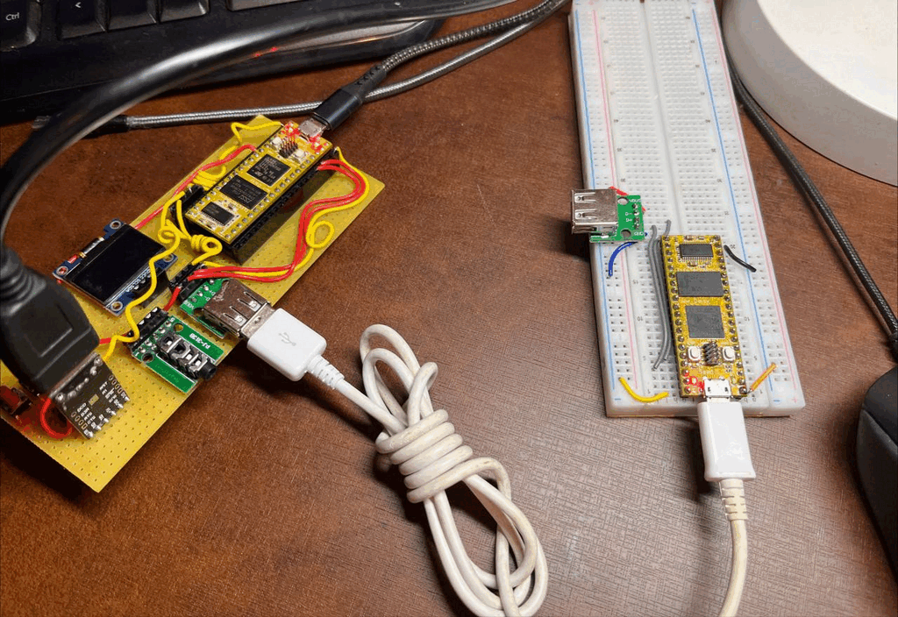
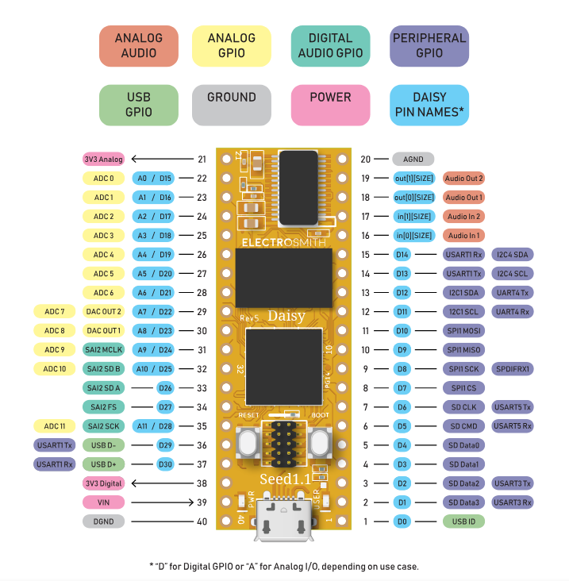

# [midi2cpp](../..) | Host MIDI 2.0
## Daisy Seed (STM32H750)

USB MIDI 2.0 host on the **Daisy Seed** (STM32H750, Cortex-M7 @ 480 MHz). A USB MIDI 2.0 device plugged into the Daisy USB-A jack is enumerated over the STM32H750 OTG_HS controller, its UMP traffic is decoded by `midi2::Host`, and the host runs Endpoint Discovery + MIDI-CI Discovery against it. The libDaisy fork carries the USB MIDI 2.0 host transport (raw UMP RX/TX on `MidiUsbTransport::Config::HOST`); all MIDI 2.0 logic lives in the recipe via `m2host`. libDaisy makefile build, no Arduino IDE. Sibling of the device recipe [`daisyseed-midi2`](../daisyseed-midi2/).



## What this is

- libDaisy host init: `USBHostHandle` registers the MIDI class, `MidiUsbTransport` is brought up in `HOST` mode on enumeration.
- Library hooks wired: `m2host` `feedRx` from the UMP receive callback, `notifyDeviceMounted` / `notifyDeviceUnmounted` from the USB host lifecycle, outbound UMP through `Tx`.
- Auto-discovery: on every mount the host issues UMP Stream Endpoint Discovery and a MIDI-CI Discovery Inquiry; the identity cache fills as the device replies.

After `daisyseed_host::Backend::begin()`, the application sees only `m2host` (`backend.host()`): typed callbacks for inbound traffic, identity for the connected device.

## What this is not

- A demo application built on top of the core. It prints decoded UMP to the Daisy log, nothing more.
- A MIDI 1.0 host. The MIDI 1.0 byte path activates the receiver but is not translated to UMP; this recipe targets MIDI 2.0 devices on Alt 1.

## Identification

The Daisy is the host here. USB identity belongs to the device plugged into the USB-A jack. The Daisy micro-USB connector exposes only the CDC log (no device-side MIDI).

| Field | Value |
|---|---|
| Role | USB MIDI 2.0 host (OTG_HS, USB-A jack) |
| Host MUID | random per boot (MIDI-CI Initiator) |
| MIDI-CI Manufacturer ID | `{0x7D, 0x00, 0x00}` (MMA educational prefix) |

## Build

Requires `arm-none-eabi-gcc`, a libDaisy checkout on branch `feat/usb-midi2-transport` (USB MIDI 2.0 host path on `MidiUsbTransport`, STM32 HAL stack, no TinyUSB). `MIDI2CPP_DIR` defaults to `../..`.

```bash
make LIBDAISY_DIR=/path/to/libDaisy
```

The libDaisy core makefile defaults to `gnu++14`; this recipe overrides `CPP_STANDARD` to `gnu++17` (midi2cpp floor). `libdaisy.a` must be prebuilt in the fork's `build/`.

## Flash

Hold BOOT on the Daisy Seed, tap RESET to enter DFU, then:

```bash
make LIBDAISY_DIR=/path/to/libDaisy program-dfu
```

Writes `build/daisyseed-host-midi2.bin` to internal flash at `0x08000000`. The Daisy web programmer or `dfu-util` work too.

## Hardware


The Daisy Seed has no USB-A connector. Wire one to the edge connector. The Daisy does not provide 5V on its pins, so VBUS comes from an external 5V supply with its ground shared with the Daisy.

| USB-A pin | Daisy Seed |
|---|---|
| 1 VBUS | external 5V supply |
| 2 D- | pin 36 (D29) |
| 3 D+ | pin 37 (D30) |
| 4 GND | pin 40 (DGND), shared with the 5V supply ground |
| shell / ID | pin 1 (D0, USB ID) tied to GND |

The USB ID pin must be tied to ground: the OTG_HS controller stays in device mode and never enumerates anything on the USB-A jack until it sees ID grounded.

Daisy Seed pinout and datasheet: <https://electro-smith.com/products/daisy-seed>.

## Spec coverage

**Tier A** (Cortex-M7 @ 480 MHz, ample SRAM + SDRAM, full host decode + MIDI-CI Initiator surface in budget).

| UMP MT | Spec | Decoded to a typed callback |
|---|---|---|
| 0x4 MIDI 2.0 Channel Voice | M2-104-UM §7 | NoteOn/Off (16-bit vel), 32-bit CC, 32-bit Pitch Bend, 32-bit Channel Pressure, Program |
| 0xD Flex Data | M2-104-UM §10 | Set Tempo (decoded to BPM) |
| 0xF UMP Stream | M2-104-UM §11 | `m2host` decodes Endpoint Info / Device Identity / Endpoint Name / Product Instance ID into the identity cache when the device answers Endpoint Discovery |

MIDI-CI: Initiator role, via `m2host`. Discovery Inquiry on mount, Discovery Reply tracking.

### What this recipe does not cover (and why)

- Per-Note controllers, Poly Pressure, RPN/NRPN inbound: `m2host` decodes them, but this recipe does not print them to keep the log readable. Add the matching `on*` callback to surface them.
- MIDI-CI Profile Configuration and Property Exchange transactions: the host issues Discovery only.
- MIDI 1.0 (Alt 0) devices: the byte path is active but not translated to UMP. This recipe targets MIDI 2.0 devices.
- Device identity in `[id]` depends on the peer answering Endpoint Discovery. A device that only emits identity at boot (like the sibling `daisyseed-midi2`) leaves the cache empty; the voice stream still decodes.

## Showcase

The bundled `daisyseed-host-midi2` executable is a live UMP monitor. On every mount it prints `[conn]` and the identity cache, then one line per inbound message:

| Log tag | Message |
|---|---|
| `[conn ]` / `[disc ]` | device mount / unmount |
| `[id   ]` | identity (alt, bcdMSC, UMP version, function blocks, endpoint name, manufacturer) |
| `[on   ]` / `[off  ]` | NoteOn / NoteOff with 16-bit velocity |
| `[cc N ]` | Control Change with 32-bit value |
| `[pb   ]` / `[chprs]` / `[prog ]` | Pitch Bend, Channel Pressure, Program |
| `[tempo]` | Flex Data Set Tempo, decoded to BPM |

The onboard LED blinks at 1 Hz as a liveness indicator.

## Validation

Pair with a known-good USB MIDI 2.0 device on the USB-A jack: the sibling device recipe [`daisyseed-midi2`](../daisyseed-midi2/), the [`rp2040-promicro-ump-test-bench`](../rp2040-promicro-ump-test-bench/) emitter, a Teensy 4.1 native device, or any MIDI 2.0 controller.

```bash
# On the Daisy log (CDC over micro-USB):
#   plug the device into the USB-A jack
#   watch [conn] then live [on]/[off]/[cc]/[pb]/[prog]/[tempo] lines
```

Hardware validated as a pair with [`daisyseed-midi2`](../daisyseed-midi2/) on a second Daisy Seed: the device plugged into the host USB-A jack enumerates, and every showcase message decodes through `m2host` into its typed callback, NoteOn/Off (16-bit velocity, chromatic walk), 32-bit CC 1 / CC 74, Pitch Bend, Channel Pressure, Program 42, and Flex Tempo (120.00 BPM).

The device's UMP Stream identity does not appear in `[id]`: the `daisyseed-midi2` device emits its endpoint identity once at boot, before the host attaches, and does not answer the host's Endpoint Discovery inquiry. The voice stream is unaffected. A device that re-emits its identity on request (or a host showcase that retries Discovery) fills the identity cache.

## Hot-swap caveat

Unplugging the device fires `notifyDeviceUnmounted`; replugging re-runs enumeration and Discovery. The host MUID is stable across hot-swaps within a boot (it is regenerated only on reset).

## What lives where

```
daisyseed-host-midi2/
  Makefile                       libDaisy makefile build, gnu++17, LIBDAISY_DIR
  src/
    main.cpp                     m2host callback wiring + log + loop
    daisyseed_host_midi2.h       Backend: USB host transport into m2host
    daisyseed_host_midi2.cpp     backend implementation
  board/
    banner.png                   README banner
    daisy-pinout.png             Daisy Seed pinout
  README.md
```

## License

MIT, inherits parent [`midi2cpp` LICENSE](../../LICENSE). libDaisy is MIT (Electro-Smith).
