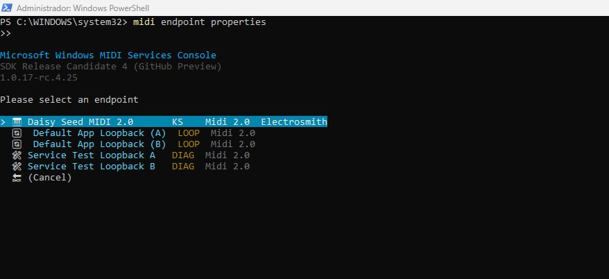
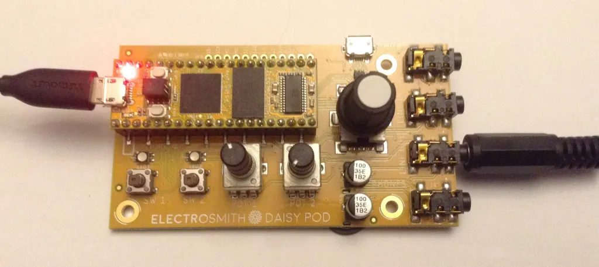

# [midi2cpp](../..) | Device MIDI 2.0
## Daisy Seed (STM32H750)

Full-spec USB MIDI 2.0 device on the **Daisy Seed** (STM32H750, Cortex-M7 @ 480 MHz). First libDaisy recipe in midi2cpp. The libDaisy fork carries USB MIDI 2.0 descriptors and raw UMP I/O only; all MIDI 2.0 logic lives in the recipe via `midi2::Device`. libDaisy makefile build, no Arduino IDE.



## USB identity

| Field | Value |
|---|---|
| VID:PID | `0483:5740` (STMicro / Daisy Seed, inherited from the libDaisy fork) |
| Product | `Daisy Seed MIDI 2.0` |
| Endpoint Name | `DaisySeed` |
| Product Instance ID | `DaisySeed-showcase-0001` |
| MIDI-CI Manufacturer ID | `{0x7D, 0x00, 0x00}` (MMA educational prefix) |
| DeviceInfo manufacturer | `midi2.diy` |

## Build

Requires `arm-none-eabi-gcc`, a libDaisy checkout on branch `feat/usb-midi2-transport` (USB MIDI 2.0 descriptors Alt 0 + Alt 1, raw UMP RX/TX on `MidiUsbTransport`, STM32 HAL stack, no TinyUSB). `MIDI2CPP_DIR` defaults to `../..`.

```bash
make LIBDAISY_DIR=/path/to/libDaisy
```

The libDaisy core makefile defaults to `gnu++14`; this recipe overrides `CPP_STANDARD` to `gnu++17` (midi2cpp floor). `libdaisy.a` must be prebuilt in the fork's `build/`.

## Flash

Hold BOOT on the Daisy Seed, tap RESET to enter DFU, then:

```bash
make LIBDAISY_DIR=/path/to/libDaisy program-dfu
```

Writes `build/daisyseed-midi2.bin` to internal flash at `0x08000000`. The Daisy web programmer or `dfu-util` work too.

## Hardware

| Pin | Use |
|---|---|
| USB micro-B (onboard) | MIDI 2.0 device (only USB function, no CDC) |
| LED (onboard) | not wired |

Daisy Seed pinout and datasheet: <https://electro-smith.com/products/daisy-seed>.

## Validation

```bash
lsusb | grep 0483:5740
amidi -l
PORT=$(amidi -l | grep -i 'Group 1' | awk '{print $2}')
timeout 7 amidi -p ${PORT} -d
ls /dev/snd/umpC*D0            # raw UMP endpoint
```

Hardware validated 2026-05-28 on Linux ALSA: enumerates `0483:5740` as `Daisy Seed MIDI 2.0`, `/dev/snd/umpC*D0` present, `Group 1` visible to ALSA, the showcase voice messages confirmed via downscaled `amidi` capture (NoteOn/Off, CC 1 / CC 74, Pitch Bend, Channel Pressure, Program). Windows MIDI Services Console shows native data format `Universal MIDI Packet`, `MIDI 2.0 Protocol = True`.

Pair with the sibling host recipe [`daisyseed-host-midi2`](../daisyseed-host-midi2/) on a second Daisy Seed: plug this device into the host's USB-A jack and the host decodes the full showcase stream over `m2host`.

## Spec coverage

Full UMP + MIDI-CI surface (Cortex-M7 @ 480 MHz, ample SRAM + SDRAM, in budget).

| UMP MT | Spec | Notes |
|---|---|---|
| 0x0 Utility | M2-104-UM §3 | JR heartbeat 500 ms |
| 0x4 MIDI 2.0 Channel Voice | M2-104-UM §7 | NoteOn/Off (16-bit vel), 32-bit CC, 32-bit Pitch Bend, 32-bit Channel Pressure, Program, Per-Note Pitch Bend, Registered Per-Note Controller |
| 0xD Flex Data | M2-104-UM §10 | Set Tempo (120 BPM), Set Time Signature (4/4) |
| 0x3 SysEx7 | M2-104-UM 7.7 | Universal Identity Reply, auto-fragmented |
| 0x5 SysEx8 + Mixed Data Set | M2-104-UM 7.8/7.10 | single stream id, single-chunk MDS |
| 0xF UMP Stream | M2-104-UM §11 | Endpoint Info, Device Identity, Endpoint Name, Product Instance ID, FB Info, FB Name |

MIDI-CI: Discovery + Endpoint Info, Profile GM 1, Property Exchange (DeviceInfo, ChannelList, ProgramList + built-in ResourceList) + Process Inquiry MIDI report, via the `m2ci` Appendix E convenience responder.

## Showcase

Always on while mounted: JR heartbeat (500 ms), UMP Stream + MIDI-CI Discovery responders, 1 Profile (GM 1), 4 PE resources (ResourceList, DeviceInfo, ChannelList, ProgramList).

Per cycle (~5 s):

| Scene | Content | MIDI 2.0 only because |
|---|---|---|
| **A.** Note | NoteOn 16-bit velocity `0xC000`, 200 ms sustain, NoteOff | 16-bit velocity |
| **B.** Resolution | 32-bit CC 1 + CC 74, 32-bit Pitch Bend, 32-bit Channel Pressure | MIDI 1.0 caps at 7/14-bit |
| **C.** Program | Program Change 42 | |
| **D.** Per-Note | Per-Note Pitch Bend, Registered Per-Note Controller #7 (Volume) | Per-Note family is MIDI 2.0 only |
| **E.** Flex Data | Set Tempo (120 BPM), Set Time Signature (4/4) | MT 0xD |

`demo_note` walks C4 (60) to C5 (72) across cycles so each NoteOn is distinguishable on a logic analyzer. Captures live in [`monitor/`](monitor/).

## License

MIT, inherits parent [`midi2cpp` LICENSE](../../LICENSE). libDaisy is MIT (Electro-Smith).
