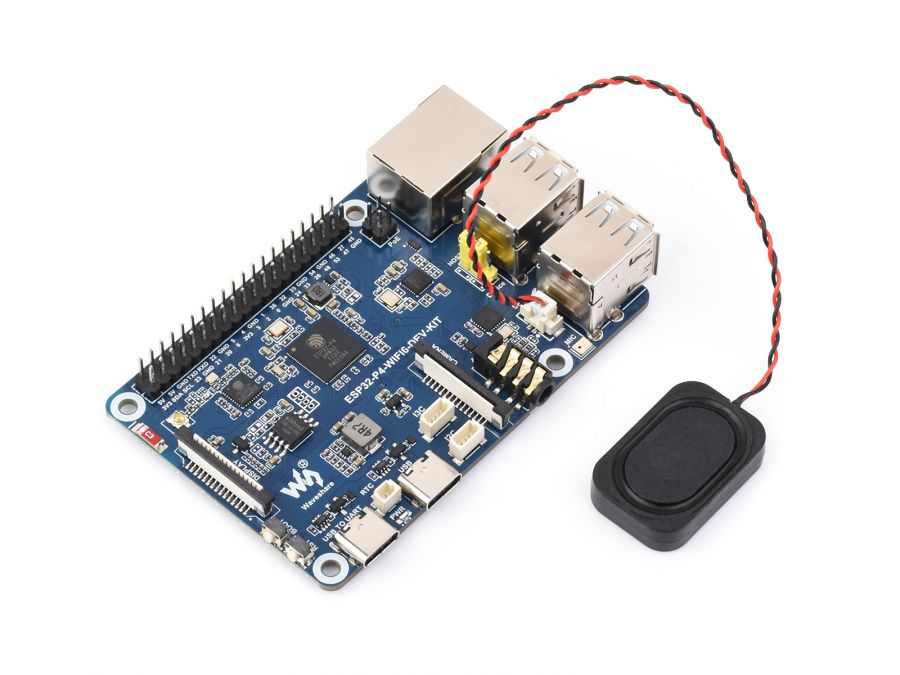

# [midi2_cpp](../..) | Bridge MIDI 2.0
## ESP32-P4-WIFI6-DEV-KIT

Dual-stack USB MIDI 2.0 **bridge** on the **Waveshare ESP32-P4-WIFI6-DEV-KIT**. Runs TinyUSB host on the USB-A jacks (UTMI PHY, OTG_HS controller, rhport 1) and TinyUSB device on the USB-Device USB-C jack (INT PHY, OTG_FS controller, rhport 0) in the same firmware, forwarding MIDI 2.0 channel-voice traffic from any upstream device into the host PC's view of `ESP32P4Bridge`. Lives at `midi2_cpp/examples/esp32-p4-devkit-bridge-midi2/` and consumes the parent library directly (no vendoring).



> ⚠️ **TinyUSB override, not yet upstream.** The USB MIDI 2.0 device + host class drivers this project depends on live in TinyUSB [PR #3571](https://github.com/hathach/tinyusb/pull/3571), still under review. Until that PR merges into `hathach/tinyusb`, this build pulls a personal fork ([`sauloverissimo/tinyusb` branch `feat/midi2-device-host-driver`](https://github.com/sauloverissimo/tinyusb/tree/feat/midi2-device-host-driver)) at a pinned SHA into `idf/external/tinyusb`, registered as an ESP-IDF component by the shim at `idf/components/tinyusb`. Treat the build as **beta**: when the PR lands upstream the override goes away and this README will point at the official TinyUSB.

## What this is

`esp32-p4-devkit-bridge-midi2` is the platform layer for a dual-stack USB MIDI 2.0 bridge on the ESP32-P4. It owns:

- ESP-IDF v5.4 dual PHY init: **UTMI host** (`USB_PHY_TARGET_UTMI`, OTG_HS, rhport 1) wired to the USB-A jacks, plus **INT device** (`USB_PHY_TARGET_INT`, OTG_FS, rhport 0) wired to the USB-Device USB-C jack via the mandatory `LP_SYS.usb_ctrl` PHY swap (D-024 in the parent decisions log)
- TinyUSB **device** stack on rhport 0 (INT PHY, full speed) with descriptors for `ESP32P4Bridge` (PID `0x4092`)
- TinyUSB **host** stack on rhport 1 (UTMI PHY, high speed) with the MIDI 2.0 host class driver from PR #3571
- Pinned FreeRTOS tasks: `tinyusb_dev` on core 0 + `tinyusb_host` on core 1, so the two stacks never starve each other under load
- Three [midi2_cpp](https://github.com/sauloverissimo/midi2_cpp) objects wired in parallel: `m2device` + `m2ci` for the PC-facing endpoint identity and CI responder, plus `m2host` for upstream device discovery + RX dispatch

After `esp32_p4_devkit_bridge::init(midi, ci, host)`, the application sees only the three m2 objects. It never touches `tud_`, `tuh_`, or `esp_` symbols. Replicating the same shape on another dual-stack board is a matter of writing `<board>_bridge.{h,cpp}` with the same surface.

## What this is not

Not a finished product. The bundled `esp32-p4-devkit-bridge-midi2` executable is a **demo application** that forwards Channel Voice messages (NoteOn, NoteOff, CC, Pitch Bend, Channel Pressure, Poly Pressure, Per-Note Pitch Bend, Program Change with bank) at the typed-callback layer. UMP Stream Discovery and MIDI-CI traffic are **not** forwarded between sides; each side answers locally so neither stack loops back on the other. Real applications copy this core and replace the showcase with their own behaviour layer:

- **Multi-Group endpoint**: expose each upstream USB-A device as a distinct UMP Group (1..N) on the PC side
- **Filter / transform**: modify UMP in transit (channel filter, MT 0x2 to MT 0x4 upscale, group remap)
- **Logger / recorder**: capture every UMP to SD card with timestamps for offline analysis (the dev-kit has a microSD slot)
- *(your project here)*

## Topology

```
                                  ┌───────────────────────────────────────┐
PC / DAW ─── USB-Device USB-C ───►│ Waveshare ESP32-P4-WIFI6-DEV-KIT      │
              (INT PHY, OTG_FS,   │   rhport 0  m2device + m2ci (responder)│
               LP_SYS swap)       │      ▲                                │
                                  │      │ typed-callback forwarding      │
                                  │      ▼                                │
                                  │   rhport 1  m2host (auto-discovery)   │
                                  └───────────────────────────────────────┘
                                          ▲
                                          │ USB-A (UTMI PHY, OTG_HS)
                                          │ via onboard CH334F hub
                                          │
                                  MIDI 2.0 device(s)
                                  up to 4 simultaneous via the hub
```

## Identification

What the PC sees on the device side (USB-Device USB-C jack):

| Field | Value |
|---|---|
| USB VID | `0xCAFE` |
| USB PID | `0x4092` |
| USB Manufacturer | `github.com/sauloverissimo` |
| USB Product | `ESP32P4Bridge` |
| MIDI-CI Manufacturer ID | `{0x7D, 0x00, 0x00}` (MIDI Association educational/non-commercial prefix) |
| MIDI-CI Family / Model / Version | `0x0001 / 0x0001 / 0x00010000` |

The bridge also runs an `m2host` instance for the upstream side, with its own MUID seeded from `esp_random()` masked to 28 bits — so the bridge is a CI Initiator towards upstream devices and a CI Responder towards the PC at the same time.

## Build

Requirements:

- **ESP-IDF v5.4 or newer** with the export script sourced (`. $IDF_PATH/export.sh`)
- The matching RISC-V toolchain (`riscv32-esp-elf`); run `$IDF_PATH/install.sh esp32p4` once on a fresh IDF
- A Waveshare ESP32-P4-WIFI6-DEV-KIT, three USB-C cables (one to the **ToUART** jack for flashing + console, one to the **USB-Device** jack for MIDI 2.0 to the PC, plus USB-A cables for the upstream devices under test)
- Internet on the first run (the bootstrap script clones the TinyUSB fork into `idf/external/tinyusb`)

```bash
git clone https://github.com/sauloverissimo/midi2_cpp.git
cd midi2_cpp/examples/esp32-p4-devkit-bridge-midi2/idf
./scripts/fetch_tinyusb.sh         # one-off, ~36 MB clone of the fork at pinned SHA
. $IDF_PATH/export.sh
idf.py set-target esp32p4
idf.py build
idf.py -p /dev/ttyACM0 flash monitor    # ToUART jack on the Waveshare kit
```

The Waveshare kit's "ToUART" USB-C jack uses a **CH343 USB-Serial-JTAG bridge** (VID `1a86:55d3`) which the Linux mainline kernel binds to `cdc_acm`, so `/dev/ttyACM0` is the natural device node for flashing + console. The CH343 has real DTR/RTS, so `idf.py flash` auto-resets the chip into download mode without a button press.

### Override TinyUSB with a local working copy

```bash
ln -sfn /path/to/your/tinyusb idf/external/tinyusb
idf.py reconfigure
```

## Hardware

| Connector / Pin | Use |
|---|---|
| USB-C "USB-Device" | INT device PHY (OTG_FS), routed to the PC. Bridge appears as `cafe:4092 ESP32P4Bridge`. Mandatory `LP_SYS.usb_ctrl` PHY swap (D-024) is applied at boot to route OTG_FS to PHY0 (GPIO24/25). |
| USB-A jacks (×2) | UTMI host PHY (OTG_HS, 480 Mbps), routed through onboard CH334F USB hub. Plug upstream MIDI 2.0 devices here. |
| USB-C "ToUART" | CH343 USB-Serial-JTAG bridge, console stdio @ 115200 8N1 + flashing |
| RJ45 | Ethernet, not used |
| Speaker JST | I2S audio out, not used |
| MIPI-CSI ribbon | Camera, not used |
| MIPI-DSI ribbon | Display, not used |
| BOOT button | Hold during reset to enter download mode (rarely needed; CH343 auto-reset handles it) |
| RESET button | Reboot |

## Console output

What the bundled `esp32-p4-devkit-bridge-midi2` executable prints on the UART console:

**Always-on (boot to forever):**

- `[boot] esp32-p4-devkit-bridge-midi2` on app start
- `Host UTMI PHY ready (rhport 1)` and `Device INT PHY ready, full speed (rhport 0)` once both PHYs are up
- `Both TinyUSB tasks started (device on core 0, host on core 1)`
- `[bridge] PC sees ESP32P4Bridge (cafe:4092)` once the device side is ready

**Per upstream device (when mounted on USB-A):**

| Event | Console line |
|---|---|
| Mount | `[host] device idx=N connected, alt=A (UMP\|byte-stream)` |
| Endpoint Info | `[ep] idx=N UMP vM.m, F FB, MIDI2=1` |
| Endpoint Name | `[ep] idx=N Endpoint Name: <product>` |
| NoteOn forwarded | `[fwd idxN] NoteOn ch=C note=N vel=0xVVVV` |
| NoteOff forwarded | `[fwd idxN] NoteOff ch=C note=N vel=0xVVVV` |
| CC forwarded | `[fwd idxN] CC ch=C #I val=0xVVVVVVVV` |
| Pitch Bend forwarded | `[fwd idxN] PitchBend ch=C val=0xVVVVVVVV` |
| Disconnect | `[host] device idx=N disconnected` |

Channel Pressure, Poly Pressure, Per-Note Pitch Bend, and Program Change with bank are also forwarded but do not log to console (re-enable in `idf/main/main.cpp` if needed).

## Validation

Hardware steps:

1. Cable the **ToUART** USB-C jack to the host for flashing + console.
2. Cable the **USB-Device** USB-C jack to the host PC. After flash, the PC enumerates `cafe:4092 ESP32P4Bridge` and exposes a MIDI 2.0 endpoint.
3. Plug any MIDI 2.0 device we ship into either USB-A jack: [`rp2040-midi2`](../rp2040-midi2), [`esp32-s3-devkitc-usb-midi2`](../esp32-s3-devkitc-usb-midi2), [`esp32-p4-devkit-usb-midi2`](../esp32-p4-devkit-usb-midi2), [`waveshare-rp2040-midi2`](../waveshare-rp2040-midi2), or any third-party MIDI 2.0 device.
4. On the PC, confirm enumeration:
   - **Linux**: `lsusb | grep cafe:4092` shows `ESP32P4Bridge`. `amidi -l` lists the bridge's MIDI 2.0 group. `aseqdump -p <bridge-port>` shows the upstream device's NoteOn / NoteOff / CC / PitchBend in real time, sourced from the bridge.
   - **Windows**: Microsoft MIDI Services Console shows `ESP32P4Bridge` with Native data format = UMP, MIDI 2.0 Protocol = True.
   - **macOS**: Audio MIDI Setup shows `ESP32P4Bridge`.
5. Watch the UART console for `[fwd idxN] ...` lines confirming each forwarded UMP. Sample log:
   ```
   [host] device idx=0 connected, alt=1 (UMP)
   [ep] idx=0 UMP v1.1, 1 FB, MIDI2=1
   [ep] idx=0 Endpoint Name: rp2040-midi2
   [fwd idx0] NoteOn ch=0 note=64 vel=0x8000
   [fwd idx0] NoteOff ch=0 note=64 vel=0x0000
   [fwd idx0] CC ch=0 #74 val=0x12345678
   ```

The dev-kit's onboard CH334F hub means up to 4 MIDI 2.0 devices can be plugged simultaneously into the USB-A jacks (one direct + a 3-port external hub) and forwarded in parallel — the same multi-device shape the host-only sibling [`esp32-p4-devkit-host-midi2`](../esp32-p4-devkit-host-midi2) ships, just with a device side bolted on.

## What lives where

```
midi2_cpp/
├── src/                            parent library (consumed by this example
│                                   via ../../../src in idf/main/CMakeLists.txt)
└── examples/esp32-p4-devkit-bridge-midi2/
    ├── README.md
    ├── board/
    │   ├── banner.jpg              repo banner (used in this README)
    │   ├── board.png
    │   ├── features.png
    │   ├── pinout.png
    │   └── ESP32-P4-WIFI6-DEV-KIT-datasheet.pdf
    ├── monitor/                    UART captures (TBD)
    └── idf/
        ├── CMakeLists.txt          ESP-IDF project root
        ├── partitions.csv          single-app, 16 MB flash
        ├── sdkconfig.defaults      target esp32p4, UART stdio, custom partition table
        ├── scripts/
        │   └── fetch_tinyusb.sh    bootstrap: clones TinyUSB fork into external/tinyusb
        ├── external/                (gitignored, populated by fetch_tinyusb.sh
        │                            or symlinked to a sibling clone)
        │   └── tinyusb/             raw clone of the PR #3571 fork at pinned SHA
        ├── components/
        │   └── tinyusb/
        │       ├── CMakeLists.txt   shim: registers BOTH device + host sources
        │       │                    of the fork as an ESP-IDF component named "tinyusb"
        │       └── usb_descriptors.c   PID 0x4092, Product "ESP32P4Bridge"
        └── main/
            ├── CMakeLists.txt      idf_component_register, pulls midi2.c +
            │                       midi2_device.cpp + midi2_ci.cpp + midi2_host.cpp
            │                       from ../../../../src
            ├── idf_component.yml
            ├── tusb_config.h       CFG_TUD_MIDI2=1 + CFG_TUH_MIDI2=1, dual rhport
            ├── esp32_p4_devkit_bridge.h    public API of the platform glue
            ├── esp32_p4_devkit_bridge.cpp  dual PHY init + dual TinyUSB tasks +
            │                               m2device + m2ci + m2host hooks
            └── main.cpp            bridge entry, host typed callbacks → device senders
```

The TinyUSB PR #3571 fork is dropped into `idf/external/tinyusb` (gitignored) by `idf/scripts/fetch_tinyusb.sh`. The shim component at `idf/components/tinyusb/` registers a curated subset of the fork's sources (tusb core + device stack + host stack + MIDI 2.0 device + host class drivers + DWC2 DCD + HCD) as a single ESP-IDF component named `tinyusb`, plus the recipe's `usb_descriptors.c` so the `tud_descriptor_*_cb` symbols sit in the same archive as `usbd.c` (the linker would otherwise drop them).

The board datasheet is bundled (`board/ESP32-P4-WIFI6-DEV-KIT-datasheet.pdf`, 4 MB) because it carries the dev-kit-specific schematic excerpt and pinout that is hard to find elsewhere. The MCU silicon datasheet is not bundled; read it on Espressif's site: [ESP32-P4 series datasheet](https://www.espressif.com/sites/default/files/documentation/esp32-p4_datasheet_en.pdf).

## License

MIT, inherits the parent [`midi2_cpp` LICENSE](../../LICENSE). The TinyUSB fork (cloned on demand into `idf/external/tinyusb`) is MIT (upstream by hathach, fork by sauloverissimo carrying the MIDI 2.0 class drivers from the still-open [PR #3571](https://github.com/hathach/tinyusb/pull/3571)).
