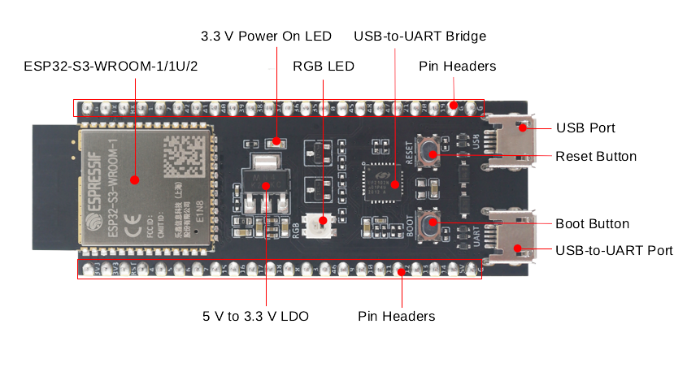

# [midi2_cpp](../..) | Host MIDI 2.0
## ESP32-S3-DevKitC-1

USB MIDI 2.0 host on the **ESP32-S3-DevKitC-1**, built on two released libraries with **no TinyUSB fork and no upstream override**: [`ESP32_Host_MIDI`](https://github.com/sauloverissimo/ESP32_Host_MIDI) v6.0.0 owns the wire (alt walk, Endpoint Discovery, UMP RX/TX) on top of ESP-IDF's native USB host stack; `m2host` from `midi2_cpp` owns the high level (typed dispatch, identity tracking, MIDI-CI Initiator). PlatformIO build.



>  **No fork, no override.** This recipe reaches MIDI 2.0 host capability without a single pending pull request in the stack.

## USB identity

Host-only role: no USB VID / PID consumed. The host plays MIDI-CI **Initiator**: it transmits Discovery Inquiry on every device mount and stores remote MUIDs in `m2host::identity(idx).ciMuid`.

| Field | Value |
|---|---|
| Role | USB MIDI 2.0 Host |
| USB transport | ESP32-S3 USB-OTG, FS 12 Mbps, ESP-IDF native `usb_host_*` |
| Host MUID (CI Initiator) | seeded at boot from `esp_random()`, masked to 28 bits |
| MIDI-CI Manufacturer ID | `{0x7D, 0x00, 0x00}` |

## Build

Requires PlatformIO Core 6.x+, an ESP32-S3-DevKitC-1, two USB cables (left jack for UART log + flash, right jack USB-OTG for the device under test).

```bash
cd pio
pio run
pio run -t upload -t monitor
```

Consumes the parent `midi2_cpp` library via `lib_extra_dirs = ../../..`. `ESP32_Host_MIDI` v6.0.0 is pulled by PlatformIO from the GitHub URL pinned in `platformio.ini`.

### Flash via the left jack (CP2102)

CP2102 has real DTR / RTS, so esptool's auto-reset puts the S3 in download mode without a button press. If `/dev/ttyUSB0` does not appear on Linux for a CP2102N variant (`11ca:0204`):

```bash
echo "11ca 0204" | sudo tee /sys/bus/usb-serial/drivers/cp210x/new_id
```

### Flash via the right jack (USB-Serial-JTAG)

The firmware claims the OTG controller after boot, so the monitor must move to the left jack afterwards. USB-Serial-JTAG has no real DTR / RTS, so a watchdog reset is required:

```bash
pio run -t upload --upload-port /dev/ttyACM0
python -m esptool --chip esp32s3 -p /dev/ttyACM0 --after watchdog_reset run
pio device monitor -p /dev/ttyUSB0
```

## Hardware

| Pin | Use |
|---|---|
| USB Port (right jack, USB-OTG) | USB Host A-side. Plug a USB MIDI 2.0 device here |
| USB-to-UART (left jack, CP2102) | Console stdio @ 115200 8N1, flash entry point |
| GPIO48 | On-board RGB LED (WS2812). Not driven |
| BOOT (GPIO0) | Hold during reset to enter download mode (only needed for USB-Serial-JTAG flash) |

The OTG jack of the S3-DevKitC-1 is wired to GPIO19 (D-) and GPIO20 (D+). DWC2 IP at Full-Speed (12 Mbps). The USB-A jack is wired direct to VBUS, supplying up to ~500 mA to the connected device. The stock board has Rd pull-down on CC (UFP-only), so host mode requires a USB-C-to-USB-A OTG adapter on the right jack.

## Validation

Plug any USB MIDI 2.0 device into the right jack. The UART log on the left jack should print:

- `[Connected] dev=0` followed by an `[Identity]` block with the device's Endpoint Name, Product Instance ID, FB count, and CI MUID.
- One `[NoteOn]` / `[NoteOff]` / `[CC]` / `[PitchBnd]` / ... line per UMP packet.
- 32-bit values where the spec gives 32 bits (CC value, Pitch Bend), 16-bit velocity for Note On.

Sample expected output:

```
[Ready  ] host MUID = 0x0AF3C21 (CI Initiator)

[Connected] dev=0
[Identity ] dev=0 alt=1 bcdMSC=0x0200 UMP=1.1 FBs=1
[Identity ]   protocols  m1=yes m2=yes
[Identity ]   ep name    "<device-endpoint-name>"
[Identity ]   prod id    "<device-product-instance-id>"
[Identity ]   manuf      7D 00 00  family=0x0001 model=0x0001 ver=0x00010000
[Identity ]   ci muid    0x123ABCD (remote)
[NoteOn  ] dev=0 g=0 ch=1  note=60  vel=0xFFFF
[CC #74  ] dev=0 g=0 ch=1  val=0xFFFFFFF9
[PitchBnd] dev=0 g=0 ch=1  val=+2147483646
```

## Spec coverage

**Tier A** host (full UMP host showcase).

| UMP MT | Direction | Spec | Notes |
|---|---|---|---|
| 0x0 Utility (JR Timestamp) | RX | M2-104-UM §3 | tracked, not surfaced as user callback (heartbeat only) |
| 0x2 MIDI 1.0 Channel Voice in UMP | RX | M2-104-UM §6 | dispatched through the same callbacks as MT 0x4 |
| 0x3 SysEx7 | RX | M2-104-UM §8 | `m2host::onSysEx7` dispatch hook |
| 0x4 MIDI 2.0 Channel Voice | RX + TX | M2-104-UM §7 | NoteOn/Off (16-bit velocity), CC (32-bit), Pitch Bend (32-bit), Channel Pressure, Poly Pressure, Program with optional Bank |
| 0x5 SysEx8 | RX | M2-104-UM §9 | `m2host::onSysEx8` dispatch hook |
| 0xD Flex Data | RX | M2-104-UM §10 | Tempo decoded; Time Sig / Key Sig / Chord Name hooks |
| 0xF UMP Stream | RX | M2-104-UM §11 | Endpoint Discovery responses forwarded to `m2host` for identity population |

MIDI-CI: Discovery Initiator only (auto-fires on mount when `setAutoDiscover(true)`, default). Replies populate `DeviceIdentity::ciMuid` and `ciDiscovered`. Profile / PE / Process Inquiry Initiator flows ship in a later cycle.

## Showcase

Always on:

- USB Host stack on OTG controller, FreeRTOS USB task on core 0 dispatching `usb_host_*` events.
- `m2host` Initiator MUID generated via `esp_random()` and printed at boot.
- Cross-core UMP queue (USB task on core 0 -> main loop on core 1) for thread-safe delivery.

Per device mount:

| Phase | What happens | Where it shows up |
|---|---|---|
| Enumeration | Configuration descriptor walked, Alt 1 (`bcdMSC=0x0200`) claimed | (silent) |
| Endpoint Discovery | Endpoint Info, Endpoint Name, Product Instance ID, Stream Config Notify, per-FB Discovery Reply | `[Identity]` block |
| CI Discovery Inquiry | `m2host::notifyDeviceMounted` triggers `sendDiscoveryInquiry`; reply populates `ciMuid` | `[Identity]` block updated with `ci muid` |
| UMP traffic | Every incoming UMP word decoded into typed callbacks | one `[NoteOn] / [CC] / ...` line per event |

Per device unmount: `[Disconnected]` line, host ready for the next plug-in. Re-plugging works without reset.

## License

MIT, inherits parent [`midi2_cpp` LICENSE](../../LICENSE). [`ESP32_Host_MIDI`](https://github.com/sauloverissimo/ESP32_Host_MIDI) is also MIT.
