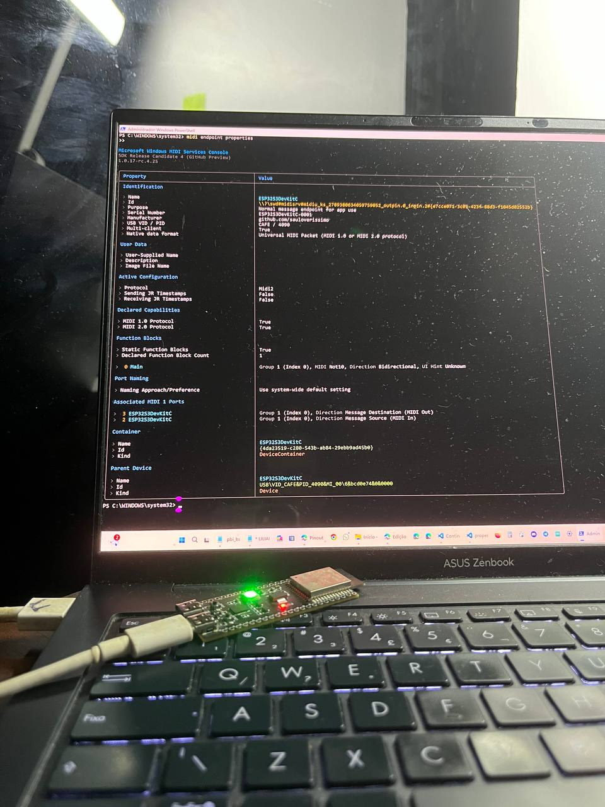
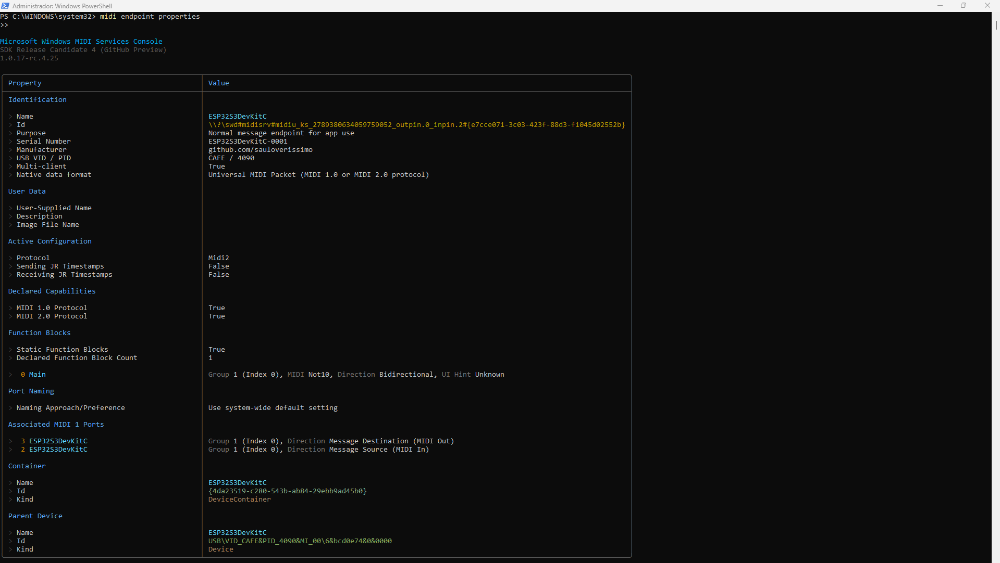
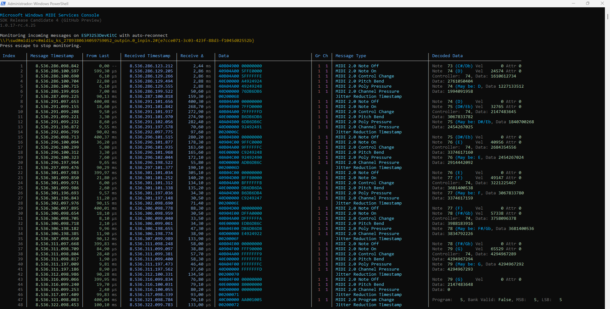

# [midi2cpp](../..) | Device MIDI 2.0
## ESP32-S3-DevKitC-1

Full-spec USB MIDI 2.0 device on the **ESP32-S3-DevKitC-1** (Xtensa LX7, USB-OTG internal PHY at full-speed 12 Mbps). Headless single-file showcase of every MIDI 2.0 message category beyond MIDI 1.0. ESP-IDF v5.4 build, no Arduino IDE.


## USB identity

| Field | Value |
|---|---|
| VID:PID | `cafe:4090` (development-only) |
| Product | `ESP32S3DevKitC` |
| Manufacturer | `github.com/sauloverissimo` |

## Build

Requires ESP-IDF v5.4+ with `. $IDF_PATH/export.sh` sourced, an ESP32-S3-DevKitC-1, two USB cables (left jack for UART + flash, right jack for native USB).

```bash
cd idf
./scripts/fetch_tinyusb.sh         # one-off, ~36 MB clone of TinyUSB upstream
. $IDF_PATH/export.sh
idf.py set-target esp32s3
idf.py build
idf.py -p /dev/ttyUSB0 flash monitor    # left jack (CP2102)
```

The left jack uses a CP2102 with real DTR / RTS, so esptool's auto-reset puts the S3 in download mode without a button press.

### CP2102 not detected on Linux

Some DevKitC-1 v1.1 boards ship a CP2102N variant with `idVendor=0x11ca`, `idProduct=0x0204`, which the `cp210x` driver does not list by default. Force the bind once per kernel session:

```bash
echo "11ca 0204" | sudo tee /sys/bus/usb-serial/drivers/cp210x/new_id
```

### Flash via the right jack (USB-Serial-JTAG)

The right jack exposes the S3 USB-Serial-JTAG ROM bootloader as `/dev/ttyACM0` before the firmware claims it. Real DTR / RTS is fake on USB-Serial-JTAG, so a watchdog reset is required:

```bash
idf.py -p /dev/ttyACM0 flash
python -m esptool --chip esp32s3 -p /dev/ttyACM0 --after watchdog_reset run
```

To override TinyUSB with a local working copy: `ln -sfn /path/to/your/tinyusb idf/external/tinyusb && idf.py reconfigure`.

## Hardware

| Pin | Use |
|---|---|
| USB Port (right jack) | Native USB-OTG, MIDI 2.0 device interface |
| USB-to-UART (left jack) | Console stdio @ 115200 8N1 (showcase log) |
| GPIO48 | On-board RGB LED (WS2812). Green = mounted, red = waiting for host. Override with `-DLED_STRIP_GPIO=<n>` for v1.0 boards (LED on GPIO38) |
| BOOT (GPIO0) | Hold during reset to enter download mode |

## Validation

```bash
lsusb | grep cafe:4090
amidi -l                        # IO  hw:N,1,0  Group 1 (Main)
PORT=$(aseqdump -l | grep -i ESP32S3DevKitC | awk '{print $1}' | tr -d ':')
timeout 30 aseqdump -p ${PORT}
```

Microsoft MIDI Services Console (Windows) shows `ESP32S3DevKitC` with Native data format = UMP, MIDI 2.0 Protocol = True.





## Spec coverage

**Tier A** (full spec). The ESP32-S3's 512 KB SRAM (plus 8 MB PSRAM on R8 variants) affords the complete UMP + MIDI-CI surface.

| UMP MT | Spec | Notes |
|---|---|---|
| 0x0 Utility | M2-104-UM §3 | JR heartbeat 500 ms, Delta Clockstamp |
| 0x4 MIDI 2.0 Channel Voice | M2-104-UM §7 | 32-bit CCs, Per-Note family, Note Attribute, RPN/NRPN, Relative RPN/NRPN |
| 0x3 SysEx7 | M2-104-UM §7.7 | up to 6 bytes per packet, auto-fragmented |
| 0xD Flex Data | M2-104-UM §10 | Tempo, Time Sig, Key Sig, Metronome, Chord Name, Start/End of Clip |
| 0xF UMP Stream | M2-104-UM §11 | full Endpoint + FB Discovery |

MIDI-CI: Discovery + Profiles (1 custom registered) + Property Exchange (3 properties: static, dynamic, subscribable) + Process Inquiry, all via the `m2ci` Appendix E convenience responder.

## Showcase

Always on while mounted: JR heartbeat (500 ms), UMP Stream + MIDI-CI Discovery responders, 1 custom Profile, 3 PE properties, Process Inquiry replies. GPIO48 LED green.

Per cycle (~22 s):

| Scene | Content | MIDI 2.0 only because |
|---|---|---|
| **A.** Flex Data | Tempo (120 BPM), Time Sig (4/4), Key Sig (C), Metronome, Chord Name (Cmaj7), Start of Clip | MT 0xD + 0xF |
| **B.** Per-Note | Sustained C4 with Per-Note Pitch Bend (5 Hz vibrato), Registered Per-Note Controller #7, Assignable Per-Note Controller #74, Per-Note Management Reset | Per-Note family is MIDI 2.0 only |
| **C.** Resolution | Chromatic walk C5→G#5 with 16-bit velocity ramp, 32-bit CC #74 sweep, 32-bit Pitch Bend, 32-bit Poly Pressure, 32-bit Channel Pressure | MIDI 1.0 caps at 7/14-bit |
| **D.** Program + Bank | Program Change with bank MSB/LSB in a single UMP | MIDI 1.0 needs three messages |
| **E.** RPN/NRPN | RPN 0/0, NRPN, Relative RPN (+delta), Relative NRPN (-delta) | RPN/NRPN first-class + Relative |
| **F.** Note Attribute | Note On with `attribute_type=0x03` (pitch_7_9), E4 +50 cents | Microtonal attribute |
| **G.** SysEx7 | Universal SysEx Identity Reply, 12 bytes, auto-fragmented (Start + End) | MT 0x3 |
| **H.** Delta Clockstamp | DCTPQ=480 + Delta Clockstamp=240 ticks | MT 0x0 utility |
| **I.** PE Notify | Broadcast `OverlayRate` change to subscribers (value increments per cycle) | Property Exchange |
| **J.** End of Clip | Sequencer End of Clip marker | MT 0xF status 0x21 |

Every scene logs to UART (left jack) at 115200 8N1.

## License

MIT, inherits parent [`midi2cpp` LICENSE](../../LICENSE).
