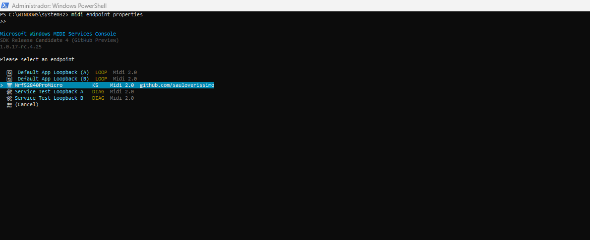
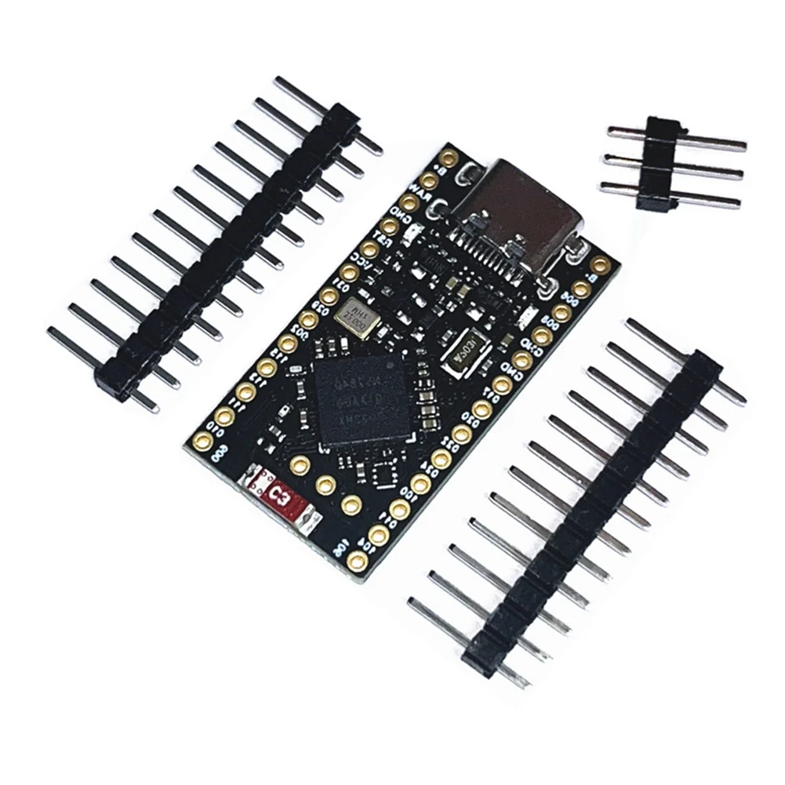
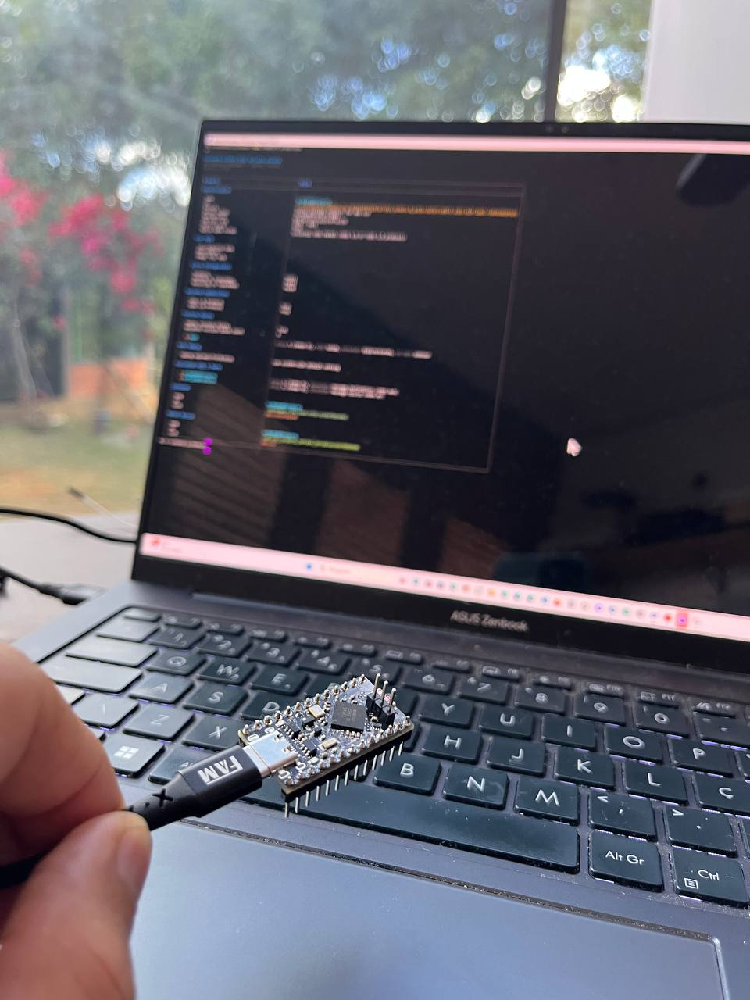

# [midi2cpp](../..) | Device MIDI 2.0
## Pro Micro nRF52840 (Nice!Nano class)

Tier B USB MIDI 2.0 device on **Pro Micro nRF52840** class boards (Nice!Nano, BlueMicro840, FYSETC nRF52840 Pro Micro, generic clones). Cortex-M4F at 64 MHz, 256 KB SRAM. Native CMake build via TinyUSB's `family_support.cmake`, ARM GNU toolchain, no Arduino IDE.



This recipe uses the upstream `feather_nrf52840_express` BSP because it matches the three things that matter on a Pro Micro nRF52840: same MCU (nRF52840 Cortex-M4F), same flash layout (FLASH ORIGIN `0x26000` matching the Adafruit nRF52 UF2 bootloader + S140 v6 region) and same RAM reservation (`0x20003400`). Only the on-board LED pin diverges (Feather: P1.15; typical clone LEDs: P1.06 / P1.07). USB enumeration and MIDI streaming are unaffected.

## USB identity

| Field | Value |
|---|---|
| VID:PID | `cafe:40F1` (development-only) |
| Product | `Nrf52840ProMicro` |
| Manufacturer | `github.com/sauloverissimo` |

## Build

Requires CMake 3.20+, `arm-none-eabi-gcc`, Python 3.

```bash
cmake -B build         # first run fetches TinyUSB + Nordic nrfx SDK
cmake --build build -j
```

Convert to UF2:

```bash
python3 build/_deps/tinyusb-src/tools/uf2/utils/uf2conv.py \
    -c -b 0x26000 -f 0xADA52840 \
    -o build/nrf52840-promicro-midi2.uf2 build/nrf52840-promicro-midi2.bin
```

The `0x26000` offset matches the Adafruit nRF52 UF2 bootloader region. `0xADA52840` is the Adafruit nRF52840 family identifier.

Pointing at a local TinyUSB checkout: `cmake -B build -DTINYUSB_PATH=/path/to/tinyusb`.

## Flash

The boards ship with the [Adafruit nRF52 UF2 bootloader](https://github.com/adafruit/Adafruit_nRF52_Bootloader). Enter bootloader by:

- double-tapping RST (or shorting the RST pad to GND on bare clones) within 500 ms, or
- `stty -F /dev/ttyACM<N> 1200; sleep 1` (1200 bps touch).

The board re-enumerates as `NICENANO` UF2 mass-storage. Drop `build/nrf52840-promicro-midi2.uf2` on it.

If the board is brand new and `lsusb` shows nothing on plug-in, flash the [Adafruit nRF52 bootloader](https://github.com/adafruit/Adafruit_nRF52_Bootloader) first via SWD (J-Link, DAPLink, picoprobe, etc.).

## Hardware



| Pin | Use |
|---|---|
| USB-C / micro-USB | USB FS device (MIDI 2.0) |
| RST button or pad | Double-tap to enter UF2 bootloader |
| P1.15 (Feather BSP `LED_PIN`) | Activity LED, not exposed on most generic clones |
| GPIO breakouts (D0..D31, A0..A7) | Free for application use |

To get a visual mount indicator on a clone, edit `src/nrf52840_promicro_midi2.cpp::led_show_mounted` and drive P1.06 / P1.07 via `nrf_gpio_pin_set` instead of `board_led_write`.

## Validation

```bash
lsusb | grep cafe:40f1
amidi -l                        # IO  hw:N,1,0  Group 1 (Main)
PORT=$(aseqdump -l | grep -i Nrf52840 | awk '{print $1}' | tr -d ':')
timeout 15 aseqdump -p ${PORT}
```

## Spec coverage

**Tier B** (standard subset). 256 KB SRAM and 1 MB flash easily fit the full UMP + MIDI-CI surface, but this recipe is intentionally scoped to a Tier B feature set focused on Channel Voice + Stream Discovery. No SysEx, no Profile Configuration, no Property Exchange, no Process Inquiry. Future variants (`nrf52840-sysex-bench`, `nice-nano-ble-midi2`) can extend the surface.

| UMP MT | Spec | Notes |
|---|---|---|
| 0x0 Utility | M2-104-UM §3 | JR heartbeat 500 ms |
| 0x4 MIDI 2.0 Channel Voice | M2-104-UM §7 | Per-Note Pitch Bend, NoteOn/Off, 32-bit CC, RPN, NRPN, Relative RPN, Relative NRPN |
| 0xF UMP Stream | M2-104-UM §11 | full Endpoint + FB Discovery |

MIDI-CI: Discovery responder only (MUID, Manufacturer, Family, Model, Version).

## Showcase

Always on while mounted: JR heartbeat (500 ms), UMP Stream + MIDI-CI Discovery responders, P1.15 LED lit (Feather BSP default).

Per cycle (~13 s):

| Window | Detail |
|---|---|
| 0 to 3.6 s | Sustained C4 with Per-Note Pitch Bend vibrato (5 Hz, +/- half a semitone, 50 ms update) |
| 3.6 to 7.6 s | Chromatic walk C5 to G#5 (8 steps, 500 ms each), 16-bit velocity ramp, 32-bit CC #74 sweep |
| 7.6 to 8.2 s | Final NoteOff |
| 8.2 to 10.6 s | RPN 0/0, NRPN 0x12/0x34, Relative RPN +delta, Relative NRPN -delta (one each, 600 ms apart) |
| 10.6 to 12.6 s | Gap |

## License

MIT, inherits parent [`midi2cpp` LICENSE](../../LICENSE). Nordic nrfx SDK is BSD-3-Clause. The Adafruit nRF52 UF2 bootloader (referenced, not vendored) is GPL-3.0.
