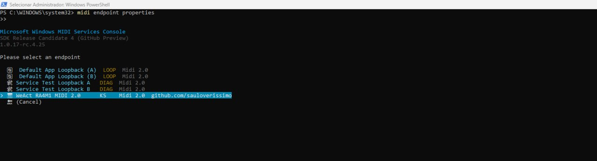
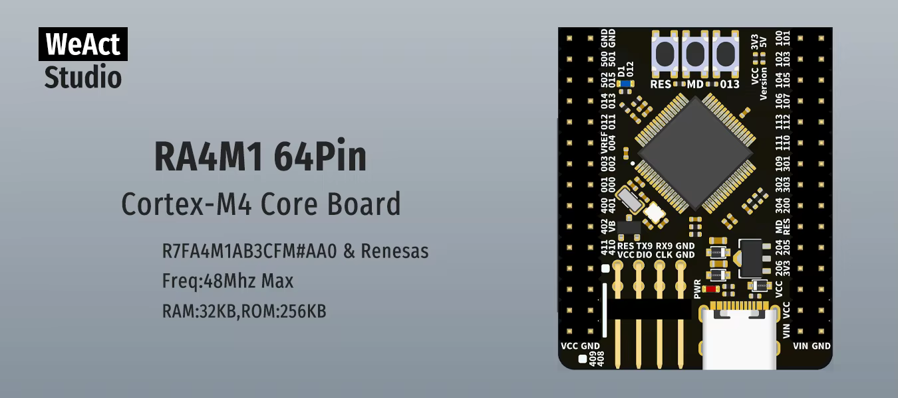
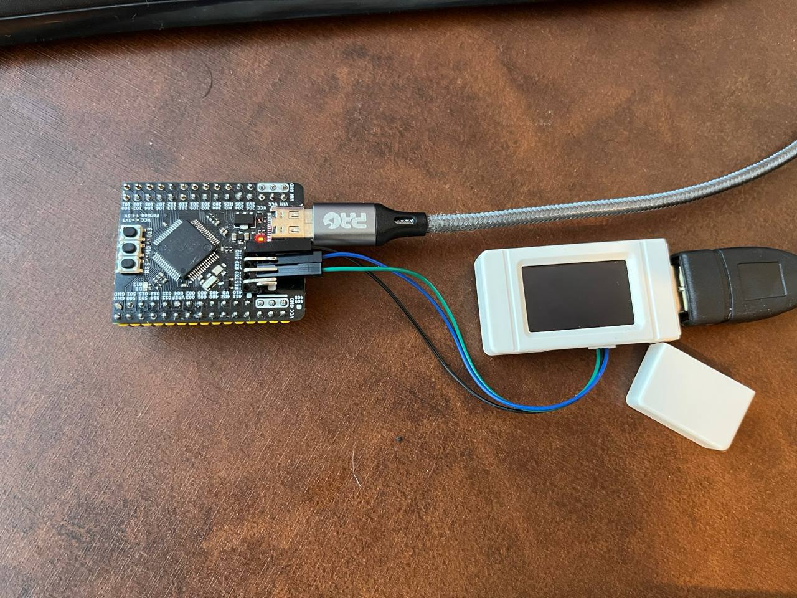
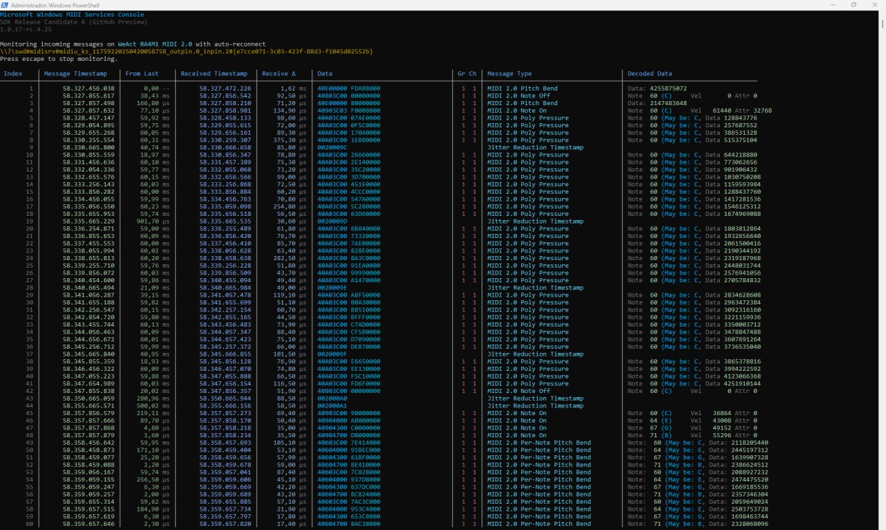

# [midi2cpp](../..) | Device MIDI 2.0
## WeAct Studio RA4M1 64-Pin Core Board

USB MIDI 2.0 device on the [**WeAct RA4M1 64-Pin Core Board**](https://github.com/WeActStudio/WeActStudio.RA4M1_64Pin_CoreBoard) (Renesas R7FA4M1AB3CFM, Cortex-M4 at 48 MHz, 32 KB SRAM, 256 KB flash). Native CMake build via TinyUSB's `family_support.cmake` and the Renesas FSP, no Arduino IDE. PID `0x40F2` distinguishes this device from the other midi2cpp examples on the same host.



> This recipe uses the TinyUSB MIDI 2.0 device class, pulled via FetchContent from upstream (PR #3738, merged). The host enumerates a native UMP endpoint with the MIDI 2.0 Protocol.

## USB identity

| Field | Value |
|---|---|
| VID:PID | `cafe:40F2` (development-only) |
| Product (`iProduct`) | `WeActRA4M1` |
| Manufacturer | `github.com/sauloverissimo` |
| UMP Endpoint Name | `WeAct RA4M1 MIDI 2.0` |
| Product Instance ID | `WeActRA4M1-showcase-0001` |
| MIDI-CI Manufacturer | `7D 00 00` (educational prefix) |

The host display name (ALSA client, Windows MIDI device) is the UMP Endpoint Name, sent by the app stream responder in `main.cpp` from `kEndpointName` (with Product Instance Id and a bidirectional Function Block). On upstream TinyUSB this is the active path, so the host reads the recipe identity. `cafe:40F2` is development-only; a product fork MUST replace `idVendor` + `idProduct` with its own allocation.

## Build

Requires CMake 3.20+, `arm-none-eabi-gcc`, Python 3.

```bash
cmake -B build         # first run fetches TinyUSB + Renesas FSP + CMSIS_6
cmake --build build -j
```

The first configure runs `tools/get_deps.py ra` to clone the Renesas FSP and CMSIS_6; it is idempotent thereafter. Output is `build/ra4m1-weact-device-midi2.{elf,hex}`, about 33 KB flash and 7 KB SRAM. Flash the `.hex`, not the `.bin` (RA high-address regions pad the flat image to tens of MB). Override the TinyUSB checkout with `-DTINYUSB_PATH=/path/to/tinyusb`.

### Board: `weact_ra4m1`


The recipe builds against `BOARD=weact_ra4m1`. That board lives in this recipe (`bsp/weact_ra4m1/`) and is copied into the TinyUSB checkout at configure time, so no upstream TinyUSB source is modified. It is a copy of the `uno_r4` BSP with the Arduino bootloader offset removed: `uno_r4` links the image at 0x4000 to clear its DFU bootloader, but the WeAct board has no bootloader and boots from 0x0, so a `uno_r4` image never runs. `weact_ra4m1` links at 0x0, keeps the internal HOCO 48 MHz clock (crystal independent), and points `LED1` at the on-board blue LED (P0.12). The on-chip USB LDO (`VDCEN`) is enabled in the board glue (`src/weact_ra4m1_midi2.cpp`).

### libstdc++ under the RA freestanding BSP

The RA BSP compiles with `-ffreestanding`, which hides `std::function` (used by the midi2cpp callback API) from the arm-none-eabi libstdc++. The recipe re-asserts `-D__STDC_HOSTED__=1` on its C++ sources; this leaves one benign `"__STDC_HOSTED__" redefined` warning.

## Flash

No UF2 bootloader. Use a CMSIS-DAP probe on the download header (silkscreen `VCC DIO CLK GND`, where `DIO` = SWDIO/P108 and `CLK` = SWCLK/P300):

```bash
pyocd pack install r7fa4m1ab
pyocd flash -t r7fa4m1ab build/ra4m1-weact-device-midi2.hex
pyocd reset -t r7fa4m1ab
```

Alternatively, enter the RA factory boot mode (hold `BOOT`/MD low at reset) and program over USB with the Renesas Flash Programmer (`rfp-cli`).

## Hardware

| Pin | Net | Use |
|---|---|---|
| USB-C `D+`/`D-` | USBFS | device endpoint |
| `P012` | blue user LED (active high) | `LED1`, blinks with the notes |
| `P108` (`DIO`) | SWDIO | SWD programming |
| `P300` (`CLK`) | SWCLK | SWD programming |
| `MD` / `BOOT` | boot mode select | factory boot flashing |

The RA4M1 USBFS transceiver runs off an on-chip LDO gated by `USBMC.VDCEN`, enabled in the board glue after `tusb_init()`. MCU silicon docs are not bundled; see the [WeAct repo `Doc/`](https://github.com/WeActStudio/WeActStudio.RA4M1_64Pin_CoreBoard/tree/master/Doc) and [Renesas RA4M1](https://www.renesas.com/en/products/microcontrollers-microprocessors/ra-cortex-m-mcus/ra4m1-32-bit-microcontrollers-48mhz-arm-cortex-m4-and-lcd-controller-and-cap-touch-hmi).

## Spec coverage

Minimal core. No SysEx, no Profile Configuration, no Property Exchange, no Process Inquiry, due to the RA4M1's 32 KB SRAM budget. Same scope as the SAMD21 sibling [`xiao-samd21-midi2`](../xiao-samd21-midi2/).

| UMP MT | Spec | Notes |
|---|---|---|
| 0x0 Utility | M2-104-UM §3 | JR heartbeat, 500 ms |
| 0x4 MIDI 2.0 Channel Voice | M2-104-UM §7 | NoteOn/Off (16-bit velocity + attribute), per-note pitch bend, per-note controller, 32-bit CC, channel pitch bend, RPN/NRPN, Program + Bank, poly pressure |
| 0xF UMP Stream | M2-104-UM §10 | Endpoint Discovery, Device Identity, Endpoint Name, Product Instance ID, Stream Config Notify, FB Info, FB Name |

MIDI-CI: Discovery responder only. Not covered: SysEx7/8 (no reassembly buffers), Profile Configuration / Property Exchange / Process Inquiry (out of scope for this recipe), MIDI 1.0 emission (Alt 0 present in the descriptor for compatibility but unused).

## Showcase

Always on while mounted: JR heartbeat (500 ms), UMP Stream + MIDI-CI Discovery responders, blue LED (P0.12) blinking with the activity.

A MIDI 2.0 feature tour: each window exercises one Channel Voice feature that a MIDI 1.0 stream cannot carry. Phases run back to back (~2 s each), then a 1 s gap, then the tour repeats (~11 s total).

| Window | Feature | Sends |
|---|---|---|
| Per-Note Pitch Bend | each note of a Cmaj7 chord (C4 E4 G4 B4) bends on its own | `sendPerNotePitchBend` per note |
| Per-Note Controller | per-note brightness fans out across the chord | `sendRegPerNoteController` #74 (32-bit) |
| High resolution | 32-bit CC #74 sweep + 32-bit channel pitch bend | `sendCC` / `sendPitchBend` |
| RPN / NRPN / Program | atomic 32-bit controllers + Bank Select | `sendProgram` (bank), `sendRpn`, `sendNrpn` |
| Poly Pressure + Attr | 16-bit velocity, note attribute, 32-bit aftertouch | `sendNoteOn` (attr), `sendPolyPressure` |



## Validation

```bash
lsusb | grep cafe:40f2                              # cafe:40f2 ... WeActRA4M1
amidi -l                                            # IO  hw:N,1,0  Group 1
PORT=$(aseqdump -l | grep -i "WeAct RA4M1" | awk '{print $1}' | head -1)
timeout 12 aseqdump -p ${PORT}                      # one feature-tour cycle (chord, bend, CC, RPN, AT)
```

On Windows, the device shows as `WeAct RA4M1 MIDI 2.0` in the Microsoft MIDI Services Console (Native data format = UMP, MIDI 2.0 Protocol = True). Pair against a host recipe such as [`adafruit-feather-rp2040-host-midi2`](../adafruit-feather-rp2040-host-midi2/).

## What lives where

```
ra4m1-weact-device-midi2/
├── CMakeLists.txt                 FetchContent TinyUSB (PR #3738) + get_deps ra + family_support (BOARD=weact_ra4m1)
├── README.md
├── board/                         product photos, host screenshots, vendor schematic
├── bsp/
│   └── weact_ra4m1/               board overlay (uno_r4 minus the bootloader offset), copied into TinyUSB at build time
└── src/
    ├── main.cpp                   showcase entry, demo cycle, LED blink
    ├── weact_ra4m1_midi2.{h,cpp}  board glue: board_init + tusb_init + VDCEN + hooks
    ├── usb_descriptors.c          VID + project PID + identity strings
    └── tusb_config.h              CFG_TUD_MIDI2 device class config
```

## License

MIT, inherits parent [`midi2cpp` LICENSE](../../LICENSE). Board schematic and banner are property of WeAct Studio, redistributed from the [WeActStudio.RA4M1_64Pin_CoreBoard](https://github.com/WeActStudio/WeActStudio.RA4M1_64Pin_CoreBoard) repository.
