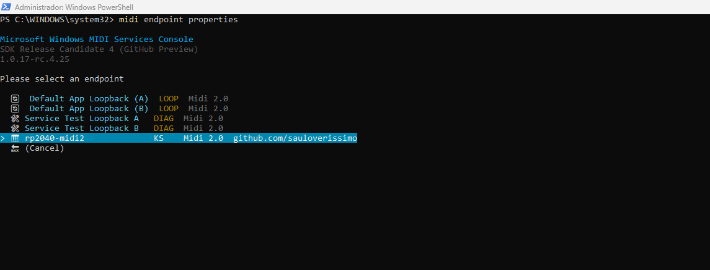
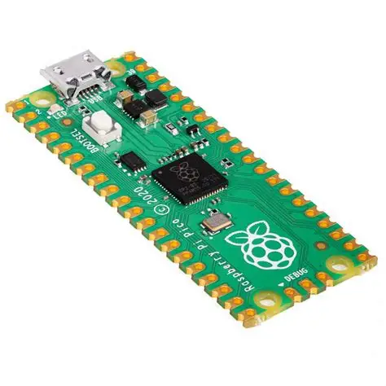
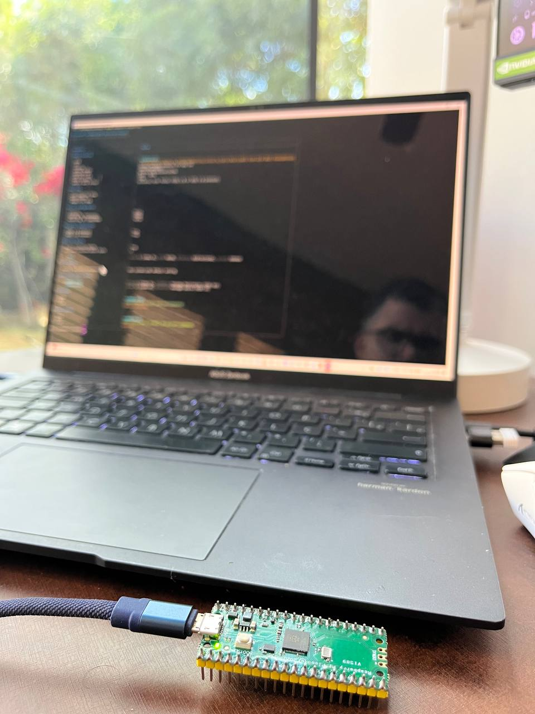

# [midi2cpp](../..) | Device MIDI 2.0
## Raspberry Pi Pico (RP2040)

[](https://github.com/midi2-dev/MIDI2.0Workbench)

Full-spec USB MIDI 2.0 device on the **Raspberry Pi Pico (RP2040)**. Headless single-file showcase of every MIDI 2.0 message category beyond MIDI 1.0. Pico SDK build, no Arduino IDE.



## USB identity

| Field | Value |
|---|---|
| VID:PID | `cafe:4070` (development-only) |
| Product | `RP2040 MIDI 2.0` |
| Manufacturer | `midi2.diy` |

## Build

Requires Pico SDK 2.x (with `PICO_SDK_PATH` exported), `arm-none-eabi-gcc`, CMake 3.14+.

```bash
cmake -B build         # first run fetches TinyUSB
cmake --build build -j
```

Pointing at a local TinyUSB checkout: `cmake -B build -DPICO_TINYUSB_PATH=/path/to/tinyusb`.

## Flash

Hold BOOTSEL on the Pico, plug USB, drag `build/rp2040-midi2-showcase.uf2` to the mounted `RPI-RP2` drive. Or `picotool load build/rp2040-midi2-showcase.uf2 -fx`.

## Hardware

| Pin | Use |
|---|---|
| USB | MIDI 2.0 device (only USB function, no CDC) |
| GP0 / GP1 | UART TX/RX debug print @ 115200 8N1 |
| GP25 | On-board LED, lit while USB is mounted (original Pico only) |

## Validation

**MIDI 2.0 Workbench compliant.** Validated against the official MIDI 2.0
Workbench (midi2-dev): Discovery v2, Profile Configuration, full Property
Exchange (DeviceInfo, ChannelList, ProgramList, X-OverlayRate), Process
Inquiry, and the interoperability checklist including the Good Random Number
Generator test, with a clean debug log (zero errors, zero warnings).


```bash
lsusb | grep cafe:4070
amidi -l
PORT=$(aseqdump -l | grep -i rp2040-midi2 | awk '{print $1}' | tr -d ':')
timeout 30 aseqdump -p ${PORT}
```

## Spec coverage

Full spec. The RP2040's 264 KB SRAM affords the complete UMP + MIDI-CI surface.

| UMP MT | Spec | Notes |
|---|---|---|
| 0x0 Utility | M2-104-UM §3 | JR heartbeat 500 ms, Delta Clockstamp |
| 0x4 MIDI 2.0 Channel Voice | M2-104-UM §7 | 32-bit CCs, Per-Note family, Note Attribute, RPN/NRPN, Relative RPN/NRPN |
| 0x3 SysEx7 | M2-104-UM §7.7 | up to 6 bytes per packet, auto-fragmented |
| 0x5 SysEx8 + Mixed Data Set | M2-104-UM 7.8/7.10 | single stream id, single-chunk MDS |
| 0xD Flex Data | M2-104-UM §10 | Tempo, Time Sig, Key Sig, Metronome, Chord Name, Start/End of Clip |
| 0xF UMP Stream | M2-104-UM §11 | full Endpoint + FB Discovery |

MIDI-CI: Discovery + Profiles (GM 1, `7E 00 00 01 00`) + Property Exchange (5 resources: ResourceList with schema, DeviceInfo, ChannelList, ProgramList, X-OverlayRate rw+subscribable) + Process Inquiry, all via the `m2ci` Appendix E convenience responder.

## Showcase

Always on while mounted: JR heartbeat (500 ms), UMP Stream + MIDI-CI Discovery responders, 1 Profile (GM 1), 5 PE resources, Process Inquiry replies. GP25 LED lit.

Per cycle (~22 s):

| Scene | Content | MIDI 2.0 only because |
|---|---|---|
| **A.** Flex Data | Tempo (120 BPM), Time Sig (4/4), Key Sig (C), Metronome, Chord Name (Cmaj7), Start of Clip | MT 0xD + 0xF |
| **B.** Per-Note | Sustained C4 with Per-Note Pitch Bend (5 Hz vibrato), Registered Per-Note Controller #7, Assignable Per-Note Controller #74, Per-Note Management Reset | Per-Note family is MIDI 2.0 only |
| **C.** Resolution | Chromatic walk C5→G#5 with 16-bit velocity ramp, 32-bit CC #74 sweep, 32-bit Pitch Bend, 32-bit Poly Pressure, 32-bit Channel Pressure | MIDI 1.0 caps at 7/14-bit |
| **D.** Program + Bank | Program Change with bank MSB/LSB in a single UMP | MIDI 1.0 needs three messages |
| **E.** RPN/NRPN | RPN 0/0, NRPN, Relative RPN (+delta), Relative NRPN (-delta) | RPN/NRPN first-class + Relative |
| **F.** Note Attribute | Note On with `attribute_type=0x03` (pitch_7_9), E4 +50 cents | Microtonal attribute |
| **G.** SysEx7 | Universal SysEx Identity Reply, 12 bytes, auto-fragmented (Start + End) | MT 0x3 |
| **H.** Delta Clockstamp | DCTPQ=480 + Delta Clockstamp=240 ticks | MT 0x0 utility |
| **I.** PE Notify | Broadcast `X-OverlayRate` change to subscribers (value increments per cycle) | Property Exchange |
| **J.** End of Clip | Sequencer End of Clip marker | MT 0xF status 0x21 |

Every scene logs to UART (GP0). Windows MIDI Services Console captures live in [`monitor/`](monitor/).

## License

MIT, inherits parent [`midi2cpp` LICENSE](../../LICENSE).
