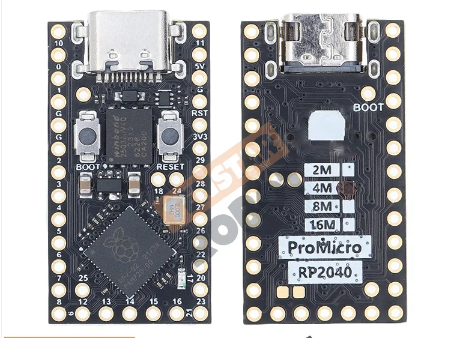
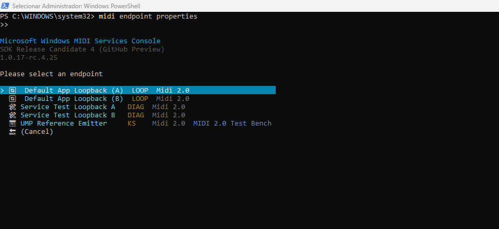

# [midi2cpp](../..) | Device MIDI 2.0
## Tenstar Robot RP2040 Pro Micro (UMP test bench)

USB MIDI 2.0 device on the **Tenstar Robot RP2040 Pro Micro**, configured as a **deterministic UMP catalog emitter**: 101 entries covering every MT category in M2-104-UM v1.1.2 (Flex Data 0x00 / 0x01 / 0x02, MIDI 2.0 + MIDI 1.0 Channel Voice, System Common / Real-Time, SysEx7, SysEx8, UMP Stream, Utility). Pico SDK build, no Arduino IDE.


## USB identity

| Field | Value |
|---|---|
| VID:PID | `cafe:4078` (development-only) |
| Product | `UMP Reference Emitter` |
| Manufacturer | `MIDI 2.0 Test Bench` |
| Function Block | 1 bidirectional, `firstGroup=0`, `numGroups=1`, name `Test Bench Group 0` |

## Build

Requires Pico SDK 2.x (with `PICO_SDK_PATH` exported), `arm-none-eabi-gcc`, CMake 3.14+.

```bash
cmake -B build         # first run fetches TinyUSB
cmake --build build -j
```

Pointing at a local TinyUSB checkout: `cmake -B build -DPICO_TINYUSB_PATH=/path/to/tinyusb`.

## Flash

Hold BOOT, plug USB-C, drag `build/rp2040-promicro-ump-test-bench-showcase.uf2` to the mounted `RPI-RP2` drive. Or `picotool load build/rp2040-promicro-ump-test-bench-showcase.uf2 -fx`.

## Hardware

| Pin | Use |
|---|---|
| USB-C | MIDI 2.0 device (only USB function, no CDC) |
| GP0 / GP1 | UART TX / RX EMIT log @ 115200 8N1 |
| BOOT | Hold while plugging USB-C to enter BOOTSEL |
| RESET | Reboot |

## Operating modes

Three coexisting trigger modes:

| Mode | Trigger | Behaviour |
|---|---|---|
| Continuous cycle | always on while mounted with `alt=1` | Catalog cycles entries 0..100..0..100... forever, one entry every 50 ms (full pass ~5 s) |
| NoteOn trigger | inbound MIDI 2.0 NoteOn, `group=15`, `channel=0` | Fires catalog index = `noteNumber` once, immediately, alongside the running cycle |
| CC loop start | inbound MIDI 2.0 CC #120, `group=15`, `channel=0` | Pauses the cycle; top byte of CC value = index to lock on; re-emits that entry every 50 ms |
| CC loop stop | inbound MIDI 2.0 CC #121, `group=15`, `channel=0` | Resumes the cycle from where it was |

Every emitted entry logs `EMIT idx=## label=... words=W0 W1 W2 W3` on UART (GP0).

## Validation

```bash
lsusb | grep cafe:4078
amidi -l                        # IO  hw:N,1,0  Group 1 (Test Bench Group 0)
```

**Linux**: any UMP-aware logger captures the auto-emit on plug. **Windows**: `midi enumerate midi-services-endpoints -i` lists `UMP Reference Emitter`. `midi endpoint <id> monitor -c capture.txt -n` captures every UMP from auto-emit. Cross-check the EMIT log on UART against the captured `.txt` file; the bytes should be identical.

## Spec coverage

Full UMP catalog. 101 of 101 entries implemented.

| UMP MT | Spec | Indices | Source-of-truth API |
|---|---|---|---|
| 0x0 Utility | M2-104-UM §7.2 | 94..98 | `sendNoop`, `sendJRClock`, `sendJRTimestamp`, `sendDctpq`, `sendDeltaClockstamp` |
| 0x1 System Common / Real-Time | M2-104-UM §7.6 | 64..73 | `sendSystem*` |
| 0x2 MIDI 1.0 Channel Voice | M2-104-UM §7.3 | 59..63 | `sendMidi1Note*`, `sendMidi1Cc`, `sendMidi1PitchBend`, `sendMidi1Program` |
| 0x3 SysEx7 | M2-104-UM §7.7 | 74..77 | `sendSysEx7` (single + multi-packet) |
| 0x4 MIDI 2.0 Channel Voice | M2-104-UM §7.4 | 35..58 | `sendNoteOn / Off`, `sendCC`, `sendPitchBend`, `sendPolyPressure`, `sendChannelPressure`, `sendProgram`, `sendPerNotePitchBend`, `sendPerNoteManagement`, `sendRegPerNoteController`, `sendAsnPerNoteController`, `sendRpn`, `sendNrpn`, `sendRelRpn`, `sendRelNrpn` |
| 0x5 SysEx8 | M2-104-UM §7.7 | 78..81 | `sendSysEx8` (single + multi-packet) |
| 0xD Flex Data | M2-104-UM §7.5 | 0..34 | `sendTempo`, `sendTimeSignature`, `sendKeySignature`, `sendMetronome`, `sendChordName`, `sendFlexText` |
| 0xF UMP Stream | M2-104-UM §7.1 | 82..93 | `sendEndpointInfo`, `sendDeviceIdentity`, `sendEndpointName*`, `sendProductInstanceId*`, `sendStreamConfigNotify`, `sendFbInfo`, `sendFbName*`, `sendStartOfClip`, `sendEndOfClip` |

MIDI-CI: minimum surface (Endpoint Discovery + Device Identity). Profile, PE, and PI subsystems are not exercised.

## License

MIT, inherits parent [`midi2cpp` LICENSE](../../LICENSE).
