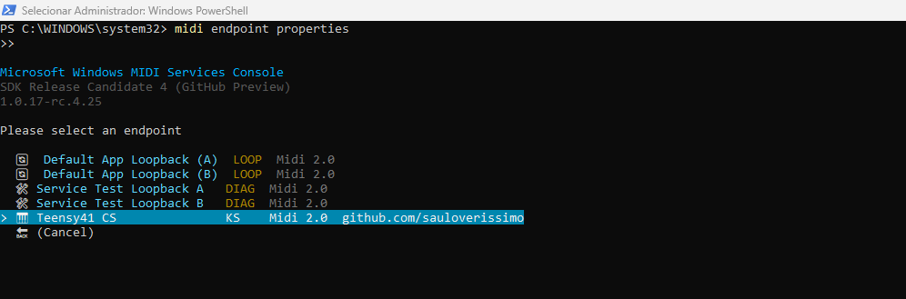
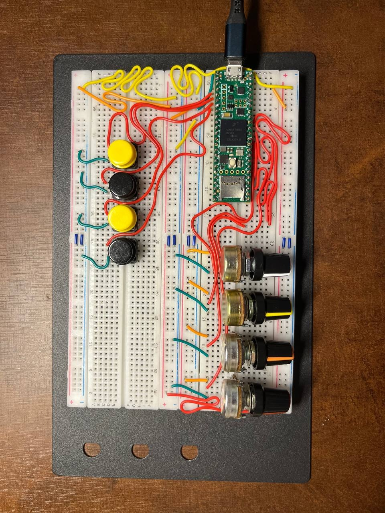

# [midi2cpp](../..) | Device MIDI 2.0
## Teensy 4.1 control surface

Hardware-driven USB MIDI 2.0 control surface on the **Teensy 4.1**. 4 pots send CC 32-bit, 4 momentary switches send NoteOn/NoteOff 32-bit, and any UMP received from the host is decoded and printed to Serial. Companion to [`teensy41-midi2`](../teensy41-midi2).



>  **Cores fork + USB names override.** Built against the Teensy cores fork [`sauloverissimo/cores`](https://github.com/sauloverissimo/cores/tree/feature/usb-midi2-descriptors) branch `feature/usb-midi2-descriptors`. Overlay `teensy4/usb.c`, `teensy4/usb_desc.{c,h}`, `teensy4/usb_midi2.{c,h}` onto your Teensyduino install. Manufacturer + Product strings come from `src/usb_names_override.c` via the cores' weak-alias hook (`usb_names.h`).

>  **USB Type menu entries.** The cores fork carries the USB MIDI 2.0 implementation, but the Arduino IDE Tools > USB Type menu entries live one level up in the Teensyduino install. Copy [`boards.local.txt`](boards.local.txt) into `~/.arduino15/packages/teensy/hardware/avr/<version>/` (Linux / macOS) or `C:\Program Files (x86)\Arduino\hardware\teensy\avr\` (Windows, IDE 1.x), then restart the Arduino IDE. The snippet was contributed by **h4yn0nnym0u5e** via the [PJRC forum thread #55239, post #368245](https://forum.pjrc.com/index.php?threads/midi-2-0.55239/post-368245), and covers Teensy 4.1, 4.0 and MicroMod.

## USB identity

| Field | Value |
|---|---|
| VID:PID | `16C0:0485` (PJRC `USB_TYPE = MIDI2` slot) |
| Manufacturer | `midi2.diy` (via `src/usb_names_override.c`) |
| Product | `Teensy41 CS` (via `src/usb_names_override.c`) |
| iSerial | per-board chip serial |
| Endpoint Name | `Teensy41 CS` |
| Product Instance ID | `Teensy41-controlsurface-0001` |
| FB 0 | `Control Surface` (Bidirectional, Group 0, both protocols) |

## Hardware


| Pin | Function | Wiring |
|---|---|---|
| A0, A1, A2, A3 | 4 pots → CC32 | wiper to A0/A1/A2/A3, ends to 3V3 and GND. 10kΩ linear |
| D2, D3, D4, D5 | 4 switches → NoteOn/Off | one terminal to D2/D3/D4/D5, other to GND. `INPUT_PULLUP`, LOW = pressed |
| USB device port | USB MIDI 2.0 + Serial 115200 |  |

CC mapping (GM 2 conventions): CC1 Modulation, CC74 Brightness, CC71 Resonance, CC91 Reverb Send. Notes: C4, C#4, D4, D#4 (60..63).

Teensy 4.1 pinout: <https://www.pjrc.com/store/teensy41.html>.

## Build

```bash
arduino-cli compile -b teensy:avr:teensy41:usb=midi2 .
arduino-cli upload  -b teensy:avr:teensy41:usb=midi2 -p <port> .
```

In the Arduino IDE: Tools > USB Type > **MIDI2** before Upload. Requires Teensyduino 1.60+, the cores fork overlaid, and the `midi2cpp` Arduino library on the sketchbook (the midi2 core is bundled).

Hardware validated 2026-05-27 on Linux ALSA (`/dev/snd/umpC*D0`): all 4 pots emitting CC1/74/71/91 with 32-bit values, all 4 switches emitting NoteOn/Off on notes 60..63, JR Timestamp heartbeat at 500 ms, decoded natively as MIDI 2.0.

## How it behaves



After enumeration the device announces UMP Stream identity (Endpoint Info, Endpoint Name, Product Instance ID, FB Info, FB Name) and starts a 500 ms JR Timestamp heartbeat. Main loop:

1. **Pots:** first-order EMA (`v += (raw - v) / 8`) + 32-LSB deadband (~0.8% of the 12-bit range). 12-bit ADC expanded to 32 bits by MSB replication.
2. **Switches:** millis-based 20 ms debounce. Press emits NoteOn velocity `0xC000`, release emits NoteOff velocity `0x4000`.
3. **RX:** `midi2::Device` typed callbacks decode NoteOn/Off, CC, PitchBend, ChannelPressure, Program, Per-Note PB, Tempo, Time Signature to Serial.

MIDI-CI is not configured here; see [`teensy41-midi2`](../teensy41-midi2) for Discovery + Profile + Property Exchange.

## What lives where

```
teensy41-control-surface/
├── README.md
├── board/
│   ├── hardware.png           assembled hardware (banner)
│   ├── pinout.png             Teensy 4.1 pinout
│   └── stack.jpg              top-down setup view
├── monitor/
│   ├── banner.png             page banner image
│   ├── monitor.png            Microsoft MIDI Services Console monitor
│   └── properties.png         Microsoft MIDI Services Console properties
├── teensy41-control-surface.ino     sketch entry (setup + loop)
└── src/
    ├── teensy41_control_surface.h   backend glue declarations
    ├── teensy41_control_surface.cpp backend glue implementation
    └── usb_names_override.c         Manufacturer + Product via weak-alias hook
```

## Spec coverage

| Area | Coverage |
|---|---|
| MIDI 2.0 Channel Voice (MT 0x4) | Note On/Off with 16-bit velocity (switches), 32-bit CC (pots) |
| UMP Stream (MT 0xF) | Endpoint Info, Device Identity, Endpoint Name, Product Instance Id, FB Info + Name (boot burst; cores fork answers GET_DESCRIPTOR GTB) |
| MIDI-CI (SysEx7) | Discovery, Profile Inquiry (GM 1), Property Exchange (DeviceInfo, ChannelList, ProgramList + built-in ResourceList), Process Inquiry |
| RX handling | NoteOn/Off, CC, Program Change printed to Serial |

Not covered: SysEx8/MDS, Flex Data, JR Timestamps (control surface stays minimal: it is an input device, not a full-surface showcase).

## License

MIT, inherits parent [`midi2cpp` LICENSE](../../LICENSE).
