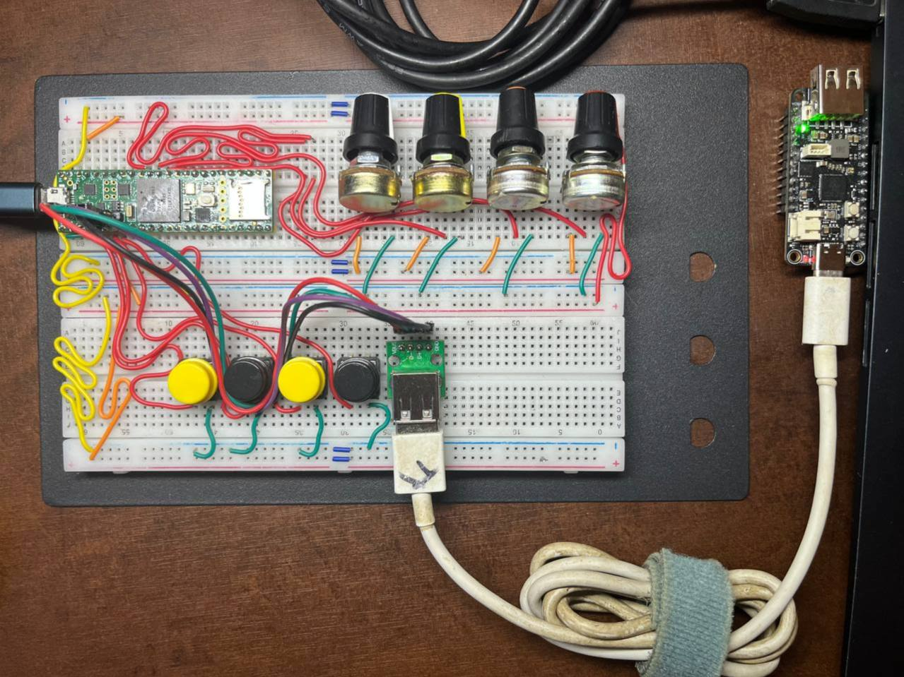

# [midi2cpp](../..) | Host MIDI 2.0
## Teensy 4.1

USB MIDI 2.0 host on the **Teensy 4.1** (Cortex-M7 @ 600 MHz, 1 MB SRAM). First Arduino IDE host recipe in midi2cpp. Backend (`src/teensy41_host_midi2.{h,cpp}`) bridges the [USBHost_t36 fork branch `feature/midi2-host-base`](https://github.com/sauloverissimo/USBHost_t36/tree/feature/midi2-host-base) (`MIDIDeviceBase::umpMode`, `readUMP`, `writeUMP`) into `midi2::Host`. Hardware validated under stress: **144,693 UMPs received over 9 min 43 s with zero loss** against the UMP test bench flood (see [Stress mode](#stress-mode)).



>  **USBHost_t36 fork.** Built against [`sauloverissimo/USBHost_t36`](https://github.com/sauloverissimo/USBHost_t36/tree/feature/midi2-host-base) branch `feature/midi2-host-base` (USB MIDI 2.0 host descriptor walk + Alt 1 SET_INTERFACE + raw UMP I/O, +110 LOC over PaulStoffregen master, not yet submitted upstream). Overlay `USBHost_t36.h` and `midi.cpp` onto `~/.arduino15/packages/teensy/hardware/avr/<version>/libraries/USBHost_t36/`.

## What this recipe is

A pure USB MIDI 2.0 host: one `MIDIDevice_BigBuffer` slot on the Teensy 4.1 host port. On mount the host fires UMP Stream Endpoint Discovery + MIDI-CI Discovery Inquiry; inbound UMP is decoded by `midi2::Host` typed callbacks and printed to Serial, one line per message. The USB device port runs as plain Serial for debug, so the Teensy does not enumerate as a MIDI device here; it is not a hub showcase (single slot) and not a bridge (that becomes `teensy41-bridge-midi2`).

Host-only recipes consume no USB PID (D-030). The peer's identity is runtime-discovered (Endpoint Name, Product Instance ID, MIDI-CI triple); the host's own MUID is seeded from `ARM_DWT_CYCCNT`, with `{0x7D, 0x00, 0x00}` as the CI Initiator educational prefix.

## Build

Requires Arduino IDE 2.x with Teensyduino 1.60+, the `USBHost_t36` fork overlaid (see note above), and the `midi2cpp` Arduino library on your sketchbook (the midi2 core is bundled).

```bash
arduino-cli compile -b teensy:avr:teensy41:usb=serial .
arduino-cli upload  -b teensy:avr:teensy41:usb=serial -p <port> .
```

In the Arduino IDE: Tools > USB Type > **Serial** before Upload (the device-side MIDI stack is intentionally off here).

## Hardware


| Pin / connector | Function |
|---|---|
| USB Device port (micro-USB) | debug print via Serial Monitor at 115200 |
| USB Host port (5-pin header) | enumerates one USB MIDI 2.0 device |

USB Host cable: 5-pin header (GND, D+, D-, 5V, GND) to USB-A receptacle. PJRC sells one at [pjrc.com/store/cable_usb_host_t36.html](https://www.pjrc.com/store/cable_usb_host_t36.html); any pigtail with the right pinout works, confirm with a continuity test first. Pinout: <https://www.pjrc.com/store/teensy41.html>.

## Spec coverage

Full UMP surface in budget for the host role.

| UMP MT | Spec | Role | Notes |
|---|---|---|---|
| 0x0 JR Timestamp | M2-104-UM §3.5.2 | rx + tx | 500 ms heartbeat, inbound via `onJRTimestamp` |
| 0x1 / 0x2 System + MIDI 1.0 CV | M2-104-UM §4.1 | rx | MIDI 1.0 peer fallback path |
| 0x4 MIDI 2.0 CV | M2-104-UM §4.2 | rx + tx | NoteOn/Off, CC, PitchBend, ChannelPressure, Program, Per-Note PB, Reg Per-Note Controller |
| 0xD Flex Data | M2-104-UM §6 | rx | Set Tempo, Set Time Signature |
| 0xF UMP Stream | M2-104-UM §7 | rx + tx | Endpoint Discovery (Initiator) + all identity notifications |

MIDI-CI: Discovery Inquiry as Initiator, auto-fired on mount. Profile / Property Exchange / Process Inquiry are reachable through `midi2::Host` but not exercised by the bundled sketch. Multi-device via hub and the bidirectional bridge are out of scope for v1 (each fits a sibling recipe without touching the backend).

## Validation

Pair with any midi2cpp **device** recipe on the peer side and watch the Serial Monitor:

- [`teensy41-midi2`](../teensy41-midi2) (Teensy 4.1 as device, the natural sibling)
- [`teensy41-control-surface`](../teensy41-control-surface) (Teensy 4.1 with pots + switches)
- [`rp2040-midi2`](../rp2040-midi2) (RP2040 device)
- [`waveshare-rp2350-usb-a-midi2`](../waveshare-rp2350-usb-a-midi2) (RP2350 device)

Also validates against any USB MIDI 2.0 device, and MIDI 1.0 controllers through the alt 0 fallback.

## Stress mode

Set `#define HOST_STRESS 1` at the top of the sketch and re-upload to turn the recipe into a zero-loss stress receiver, the pair of the UMP test bench flood ([`rp2040-promicro-ump-test-bench`](../rp2040-promicro-ump-test-bench) built with `-DBENCH_AUTOFLOOD=ON`). NoteOn/NoteOff stop printing per message (a print mid-burst would stall the RX path and fake a loss); the flood's monotonic sequence is checked for contiguity and a verdict prints once the flood goes idle. Same shape as `HOST_STRESS` in [`adafruit-feather-rp2040-host-midi2`](../adafruit-feather-rp2040-host-midi2).

Hardware validated 2026-06-11: 144,693 UMPs over 9 min 43 s, one 16-bit sequence wrap-around intact, zero gaps.

## Hot-swap caveat

USBHost_t36 handles disconnect / reconnect natively; `umpMode()` returns false during the gap, the edge detector fires `notifyDeviceUnmounted`, and the next mount triggers a fresh Discovery cycle. No watchdog reset needed (unlike RP2040 PIO-USB).

## License

MIT, inherits parent [`midi2cpp` LICENSE](../../LICENSE).
