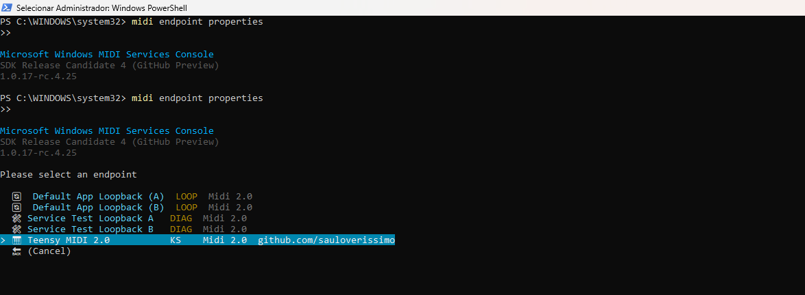
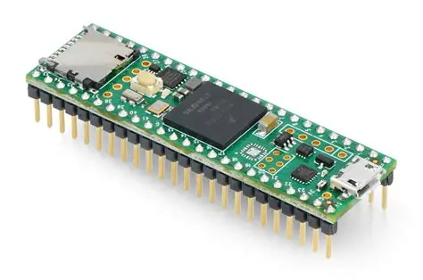
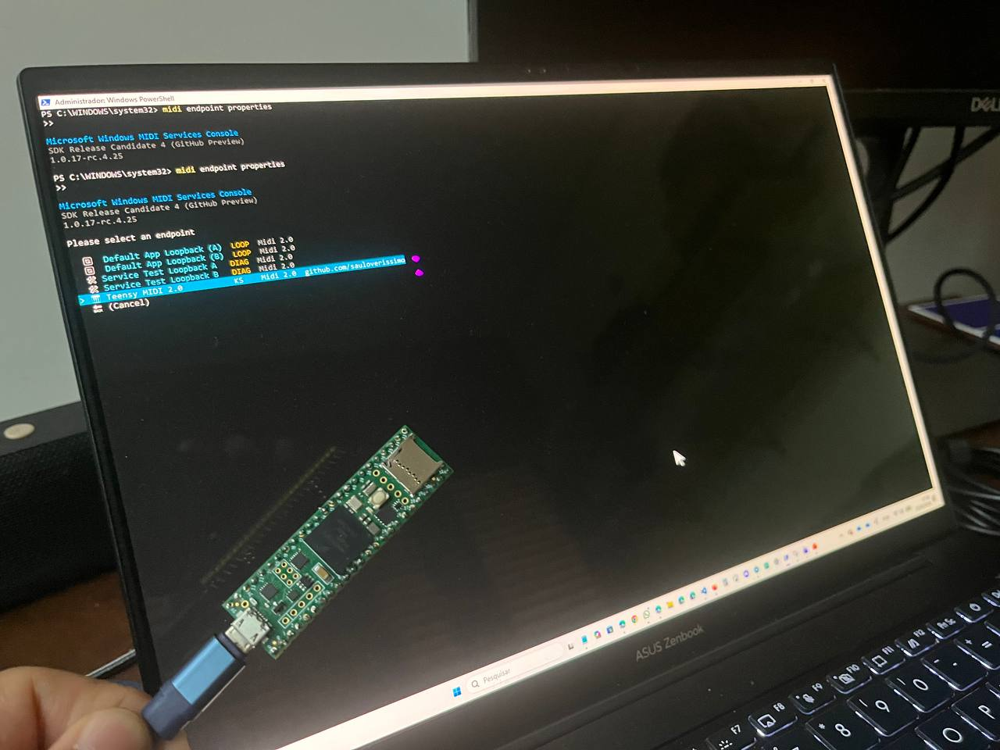

# [midi2cpp](../..) | Device MIDI 2.0
## Teensy 4.1

USB MIDI 2.0 device on the **Teensy 4.1** (Cortex-M7 @ 600 MHz, 1 MB SRAM). First Arduino IDE / arduino-cli recipe in midi2cpp. Backend (63 LOC, `src/teensy41_midi2.{h,cpp}`) bridges the Teensy cores fork USB MIDI 2.0 primitives (`usbMIDI2.read/write/altSetting`) into `midi2::Device` / `midi2::CI`.



>  **Cores fork + USB names override.** Built against the Teensy cores fork [`sauloverissimo/cores`](https://github.com/sauloverissimo/cores/tree/feature/usb-midi2-descriptors) branch `feature/usb-midi2-descriptors` (USB MIDI 2.0 descriptor + raw I/O primitives, +625 LOC over PaulStoffregen master, not yet submitted upstream). Overlay `teensy4/usb.c`, `teensy4/usb_desc.{c,h}`, `teensy4/usb_midi2.{c,h}` onto your Teensyduino install at `~/.arduino15/packages/teensy/hardware/avr/<version>/cores/teensy4/`. Manufacturer + Product strings come from `src/usb_names_override.c` via the cores' weak-alias hook (`usb_names.h`).

>  **USB Type menu entries.** The cores fork carries the USB MIDI 2.0 implementation, but the Arduino IDE Tools > USB Type menu entries live one level up in the Teensyduino install. Copy [`boards.local.txt`](boards.local.txt) into `~/.arduino15/packages/teensy/hardware/avr/<version>/` (Linux / macOS) or `C:\Program Files (x86)\Arduino\hardware\teensy\avr\` (Windows, IDE 1.x), then restart the Arduino IDE. The snippet was contributed by **h4yn0nnym0u5e** via the [PJRC forum thread #55239, post #368245](https://forum.pjrc.com/index.php?threads/midi-2-0.55239/post-368245), and covers Teensy 4.1, 4.0 and MicroMod.

## USB identity

| Field | Value |
|---|---|
| VID:PID | `16C0:0485` (PJRC `USB_TYPE = MIDI2` slot under the V-USB shared VID, kept intact) |
| Manufacturer | `github.com/sauloverissimo` (via `src/usb_names_override.c` weak-alias hook) |
| Product | `Teensy41` (via `src/usb_names_override.c` weak-alias hook) |
| iSerial | per-board chip serial |
| Endpoint Name | `Teensy41` |
| Product Instance ID | `Teensy41-showcase-0001` |
| FB 0 | `Main` (Bidirectional, Group 0 in API / `Group 1-1` in ALSA, both protocols). Name visible in Windows MIDI Services Console; Linux ALSA shows `Group 1-1` since the cores fork GTB descriptor currently emits `iBlockItem = 0` (no Block Name string yet). |
| MIDI-CI Manufacturer ID | `{0x7D, 0x00, 0x00}` (MMA educational prefix) |

Forking into a real product requires replacing both VID and PID per USB-IF rules (pid.codes, V-USB sub-allocation, or USB-IF VID).

## Build

Requires Arduino IDE 2.x with Teensyduino 1.60+, the cores fork overlaid (see note above), and the `midi2cpp` Arduino library on your sketchbook (the midi2 core is bundled).

```bash
arduino-cli compile -b teensy:avr:teensy41:usb=midi2 .
arduino-cli upload  -b teensy:avr:teensy41:usb=midi2 -p <port> .
```

In the Arduino IDE: Tools > USB Type > MIDI2 before pressing Upload.

## Hardware



| Pin | Function |
|---|---|
| USB device port (micro-USB) | enumerates as USB MIDI 2.0 device on host |
| LED 13 (built-in) | not wired |

Teensy 4.1 pinout: <https://www.pjrc.com/store/teensy41.html>.

## Validation

```bash
aconnect -l                    # client X: 'Teensy41' [type=kernel]
amidi -p hw:X,1,0 -d           # downscaled MIDI 1.0 view
ls /dev/snd/umpC*D0            # raw UMP stream
```

Windows: Microsoft MIDI Services Console `midi endpoint properties` shows native data format `Universal MIDI Packet (MIDI 1.0 or MIDI 2.0 protocol)` and the registered Profile / Properties.

Hardware validated 2026-05-25 on Linux ALSA (rawmidi UMP capture, MT 0x4 / 0xD / 0x0 confirmed) and Windows MIDI Services Console (RC4, Production Preview) showing the showcase loop decoded natively as MIDI 2.0.

## Spec coverage

Full UMP surface (Cortex-M7 @ 600 MHz, 1 MB SRAM, in budget).

| UMP MT | Spec | Notes |
|---|---|---|
| 0x0 JR Timestamp | M2-104-UM §3.5.2 | heartbeat 500 ms via `enableJRHeartbeat` |
| 0x4 MIDI 2.0 CV | M2-104-UM §4.2 | NoteOn/Off (16-bit vel), CC (32-bit), PitchBend (32-bit), ChannelPressure (32-bit), Program, Per-Note PitchBend, Reg Per-Note Controller |
| 0xD Flex Data | M2-104-UM §6 | Set Tempo (120 BPM), Set Time Signature (4/4) |
| 0xF UMP Stream | M2-104-UM §7 | Endpoint Info, Device Identity, Endpoint Name, Product Instance ID, FB Info, FB Name |

MIDI-CI: Discovery + Endpoint Info, one Profile (`addProfile`), two Property Exchange properties (`DeviceInfo` static, `ChannelList` static + subscribable). Process Inquiry code path present, no `setMidiReport` call.

## Showcase



96-line sketch `teensy41-midi2.ino` runs a 5-second loop:

1. `sendNoteOn` 16-bit velocity `0xC000`, 200 ms sustain, then `sendNoteOff`
2. `sendCC` 32-bit on CC 1 (Modulation) and CC 74 (Brightness)
3. `sendPitchBend` 32-bit, `sendChannelPressure` 32-bit, `sendProgram`
4. `sendPerNotePitchBend` and `sendRegPerNoteController` (Volume)
5. `sendTempo` 120 BPM and `sendTimeSignature` 4/4 via Flex Data

`demo_note` walks 60..72 across cycles so each NoteOn is distinguishable on a logic analyzer.

## License

MIT, inherits parent [`midi2cpp` LICENSE](../../LICENSE).
