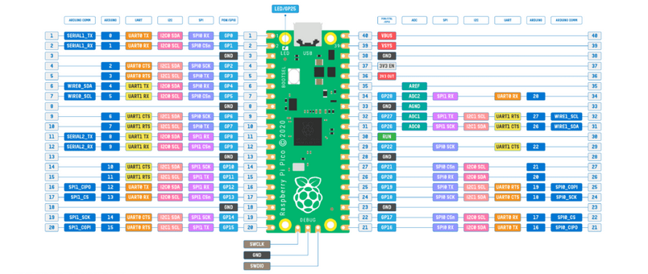

# [midi2_cpp](../..) | Device MIDI 2.0
## UMP Test Bench (RP2040 Pro Micro)

Deterministic UMP emitter for the **Windows MIDI Services consumer side**. Targets a generic **RP2040 Pro Micro** form factor (USB-C, 25 GPIOs exposed, BOOT and RESET only, no onboard buttons or display). Lives at `midi2_cpp/examples/ump-test-bench-rp2040/` and consumes the parent library directly (no vendoring).



> WARNING: TinyUSB MIDI 2.0 device class is consumed from PR [#3571](https://github.com/hathach/tinyusb/pull/3571), pinned by SHA at `31d730d8b...`. Not yet upstream. CMake fetches the fork automatically; pass `-DPICO_TINYUSB_PATH=/path/to/local/fork` if you have a working copy.

## What this is

- **Pico SDK** init + TinyUSB device init + midi2_cpp wiring through the five public hooks (`setWriteFn`, `feedRx`, `setNowFn`, `setMounted`, `CI::setRngFn`)
- **1 USB MIDI 2.0 endpoint** with 1 bidirectional Function Block (`firstGroup=0`, `numGroups=1`, name `Test Bench Group 0`)
- **Deterministic UMP catalog** of 101 entries covering every MT category in M2-104-UM v1.1.2 (Flex Data 0x00 / 0x01 / 0x02, MIDI 2.0 + MIDI 1.0 Channel Voice, System Common / Real-Time, SysEx7, SysEx8, UMP Stream, Utility, two intentional edge cases)
- **Three operating modes** that coexist: boot auto-emit (50 ms inter-message), inbound NoteOn group=15 trigger, inbound CC 120/121 group=15 loop start/stop
- **EMIT log line per UMP** on UART GP0/GP1 @ 115200 8N1, format `EMIT idx=## label=... words=W0 W1 W2 W3`

After `rp2040_midi2::init(midi, ci)`, the application sees only `m2device` + `m2ci` plus the catalog API.

## What this is not

- Not a general-purpose MIDI 2.0 device, the showcase loop is replaced by a deterministic catalog driver
- Not a host or a bridge, this is a device-only emitter
- Not a code-style or correctness reference for the catalog itself, the source of truth is M2-104-UM v1.1.2 + the Microsoft Windows MIDI Services consumer

## Identification

| Field | Value |
|---|---|
| USB VID:PID | `0xCAFE:0x4078` |
| USB Manufacturer | `MIDI 2.0 Test Bench` |
| USB Product | `UMP Reference Emitter` |
| USB Serial | derived from RP2040 unique chip id |
| UMP Endpoint Name | `UMP Reference Emitter` |
| UMP Product Instance Id | `UMPReferenceEmitter-bench-0001` |
| Function Block | 1 bidirectional, `firstGroup=0`, `numGroups=1` |
| Function Block Name | `Test Bench Group 0` |
| MIDI-CI Manufacturer Id | `{0x7D, 0x00, 0x00}` (educational prefix) |
| MIDI-CI Family / Model / Version | `0x0001 / 0x0001 / 0x00010000` |

## Build

```bash
git clone https://github.com/sauloverissimo/midi2_cpp.git
cd midi2_cpp/examples/ump-test-bench-rp2040
PICO_SDK_PATH=/path/to/pico-sdk cmake -B build
cmake --build build -j
```

Output: `build/ump-test-bench-rp2040-showcase.uf2`. Drag-and-drop onto the RP2040 mass-storage device while BOOTSEL is held.

Override flags:

| Flag | Purpose |
|---|---|
| `-DPICO_TINYUSB_PATH=...` | use a local TinyUSB PR #3571 checkout instead of FetchContent |
| `-DPICO_BOARD=<id>` | override the SDK board target if your Pro Micro variant has a board header (default `pico` works for the generic AliExpress RP2040 Pro Micro) |

## Hardware

The generic AliExpress RP2040 Pro Micro is pinout-compatible with the SparkFun Pro Micro RP2040 (DEV-18288) and similar Pro Micro form factor RP2040 boards: 2 x 12 castellated pads + 2 extra side pads, USB-C connector, BOOT and RESET buttons, no display, no encoder. The Pico SDK generic `pico` target works because the RP2040 USB controller and clock topology are identical across these boards.

| Pin | Use |
|---|---|
| USB-C | host link (USB MIDI 2.0) |
| GP0 | UART0 TX, EMIT log @ 115200 |
| GP1 | UART0 RX |
| BOOT button | mass-storage flash on press |
| RESET button | reboot |

Confirm GP0 / GP1 expose the UART on your specific Pro Micro variant. Some clones swap the UART pinout; the EMIT log will be silent if the wires land elsewhere.

> No hardware modification is required. The bench operates as a USB device on the native RP2040 USB controller; no PIO-USB, no power gate, no cable cut.

## Operating modes

| Mode | Trigger | Behavior |
|---|---|---|
| Continuous cycle | always on while mounted + alt=1 | Catalog cycles `0..100..0..100..` forever, one entry every 50 ms (one full pass takes ~5 s). Open the Windows MIDI Services monitor at any time and the next pass is captured. |
| NoteOn trigger | inbound MIDI 2.0 NoteOn, group=15, channel=0 | Fires catalog index = `noteNumber` once, immediately, alongside the running cycle. Velocity ignored. |
| CC loop start | inbound MIDI 2.0 CC controller=120, group=15, channel=0 | Pauses the cycle. Top byte of the 32-bit CC value is the index to lock on; re-emits that entry every 50 ms. |
| CC loop stop | inbound MIDI 2.0 CC controller=121, group=15, channel=0 | Resumes the cycle from where it was. |

The cycle is the default; the on-demand triggers exist for pinpoint testing of a single index. Plug-in is enough to see UMPs flowing.

## Spec coverage

**Tier A**: full UMP showcase (RP2040 hardware bracket, TinyUSB PR #3571 device class).

| UMP MT | Spec section | Indices in catalog | Source-of-truth API |
|---|---|---|---|
| 0x0 Utility | M2-104-UM §7.2 | 94..98 | `sendNoop`, `sendJRClock`, `sendJRTimestamp`, `sendDctpq`, `sendDeltaClockstamp` |
| 0x1 System Common / Real-Time | M2-104-UM §7.6 | 64..73 | `sendSystem*` (verify exact API names against `midi2_device.h`) |
| 0x2 MIDI 1.0 Channel Voice | M2-104-UM §7.3 | 59..63 | `sendMidi1Note*`, `sendMidi1Cc`, `sendMidi1PitchBend`, `sendMidi1Program` |
| 0x3 SysEx7 | M2-104-UM §7.7 | 74..77 | `sendSysEx7` (single + multi-packet) |
| 0x4 MIDI 2.0 Channel Voice | M2-104-UM §7.4 | 35..58 | `sendNoteOn/Off`, `sendCC`, `sendPitchBend`, `sendPolyPressure`, `sendChannelPressure`, `sendProgram`, `sendPerNotePitchBend`, `sendPerNoteManagement`, `sendRegPerNoteController`, `sendAsnPerNoteController`, `sendRpn`, `sendNrpn`, `sendRelRpn`, `sendRelNrpn` |
| 0x5 SysEx8 | M2-104-UM §7.7 | 78..81 | `sendSysEx8` (single + multi-packet) |
| 0xD Flex Data | M2-104-UM §7.5 | 0..34 | `sendTempo`, `sendTimeSignature`, `sendKeySignature`, `sendMetronome`, `sendChordName`, `sendFlexText` |
| 0xF UMP Stream | M2-104-UM §7.1 | 82..93 | `sendEndpointInfo`, `sendDeviceIdentity`, `sendEndpointName*`, `sendProductInstanceId*`, `sendStreamConfigNotify`, `sendFbInfo`, `sendFbName*`, `sendStartOfClip`, `sendEndOfClip` |

MIDI-CI surface: minimum (Endpoint Discovery + Device Identity). The bench is a deterministic emitter, not a CI-rich device, so Profile / PE / PI subsystems are deliberately not exercised here.

### What this recipe does NOT cover (and why)

- **MIDI-CI Profiles, PE, PI**: out of scope. The catalog tests UMP wire format, not MIDI-CI negotiation. The sibling `rp2040-midi2` recipe is the CI-rich showcase.
- **Multi-Group Function Blocks**: out of scope. 1 FB / 1 group keeps the catalog deterministic and the inbound trigger filter on group 15 trivial.
- **Hot-swap behavior**: device-only, not relevant.

## Spec source

The catalog spec lives at [`docs/plans/2026-04-28-ump-test-bench-rp2040.md`](../../../docs/plans/2026-04-28-ump-test-bench-rp2040.md) at the repo root. That document is the source of truth for the 101-entry table, the trigger semantics, and the EMIT log format. The README's `## Operating modes` and `## Spec coverage` sections are summaries.

## Implementation status

**101 of 101 entries implemented**. Build is clean (zero warnings, zero errors); text=104 KB, bss=4.3 KB, uf2=208 KB.

Coverage by layer:

| Spec layer | Indices | Notes |
|---|---|---|
| Flex Data 0x00 (Setup/Performance) | 0..18 | tempo, time signature, key signature, metronome, chord name |
| Flex Data 0x01 (Metadata Text) | 19..29 | single-packet + multi-packet UTF-8 |
| Flex Data 0x02 (Performance Text) | 30..34 | lyrics, language, ruby, multi-packet, comment |
| MIDI 2.0 Channel Voice | 35..58 | full MT 0x4 surface |
| MIDI 1.0 Channel Voice | 59..63 | sanity / regression |
| System Common / Real-Time | 64..73 | timing clock x24, start, continue, stop, MTC, song pos, song select, tune req, active sensing, reset |
| Data Messages (SysEx7 + SysEx8) | 74..81 | complete + start/continue/end |
| UMP Stream | 82..93 | endpoint discovery (via pumpRaw), endpoint info, device identity, endpoint name, product instance id, stream config (req via pumpRaw + notify), FB discovery (via pumpRaw) + info + name, start/end of clip |
| Utility | 94..98 | noop, JR clock, JR timestamp, DCTPQ, delta clockstamp |
| Edge cases | 99..100 | reserved bit set on Set Tempo (via pumpRaw), unassigned status 0x42 in bank 0x00 (via pumpRaw) |

Five entries (Endpoint Discovery, Stream Config Request, FB Discovery, plus the two edge cases) have no `sendXxx` in `midi2_cpp` (those messages are normally consumed by a Device, not emitted). For those, the bench builds the UMP words via the `midi2.h` C99 inline helpers and pushes them through `rp2040_midi2::pumpRaw`, a thin wrapper around `tud_midi2_n_ump_write`. This keeps the bench self-contained without touching the library.

Caveats worth flagging on the host side:

- `midi2_msg_time_sig` (used by `sendTimeSignature`) only encodes `numerator` and `denominator` in word 1, no thirty-seconds-per-quarter byte. The spec doc §5.1 nominally calls for `thirty_seconds = 8` on every Set Time Signature entry; with the current builder, that field stays at zero. Confirm interpretation against M2-104 §7.5.4 on the consumer side; if the spec really requires it, that is an upstream fix in `midi2`, not in the recipe.
- Chord type codes (M2-104 Table 14) are documented inline only for 0x01 (Major), 0x03 (Major 7), 0x07 (Minor) in the `midi2` C99 source. The bench uses those three plus best-effort approximations for Dm7 (Minor), G7 (Major), F#dim (Minor) so the catalog still emits consistent words; tweak `make_chord` calls when the host-side reading of Table 14 confirms the right codes.

## Validation

1. **Linux**: `lsusb` shows `0xCAFE:0x4078`, then `amidi -l` lists `UMP Reference Emitter`. `amidiminator` (or any UMP-aware logger) captures the auto-emit on plug.
2. **Windows**: `midi enumerate midi-services-endpoints -i` lists `UMP Reference Emitter`. `midi endpoint <id> monitor -c capture.txt -n` captures every UMP from auto-emit.
3. **Cross-check** the EMIT log on UART against the captured `.txt` file. Indices that are implemented (1, 3, 14) should produce identical bytes on both sides; indices that are still stubbed produce `00000000 00000000 00000000 00000000` in the EMIT log and nothing on the wire.

Pair with the sibling `[rp2040-midi2](../rp2040-midi2/)` device recipe to confirm the Pro Micro variant enumerates the same way as the canonical Pico target.

## What lives where

```
ump-test-bench-rp2040/
├── CMakeLists.txt
├── pico_sdk_import.cmake
├── README.md
├── board/
│   ├── banner.png         (TBD, supplied by user)
│   └── rp2040pinout.png   (inherited from rp2040-midi2 source recipe)
└── src/
    ├── main.cpp           (bootstrap + trigger handlers + auto-emit driver)
    ├── catalog.h          (catalog API)
    ├── catalog.cpp        (catalog implementation, 101 of 101 entries)
    ├── rp2040_midi2.h     (board core public API, adds pumpRaw vs sibling)
    ├── rp2040_midi2.cpp   (board core impl, adds pumpRaw vs sibling)
    ├── tusb_config.h      (TinyUSB device config)
    └── usb_descriptors.c  (USB descriptors with PID 0x4078 and bench identity)
```

## License

MIT, inherits the parent. TinyUSB credit lines unchanged from the sibling recipes.
