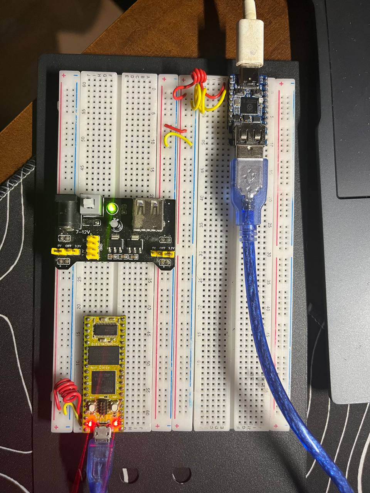

# [midi2cpp](../..) | Bridge MIDI 2.0
## Waveshare RP2350-USB-A

Transparent USB MIDI 2.0 bridge on the **Waveshare RP2350-USB-A**. Runs TinyUSB host on USB-A (PIO-USB GP12 / GP13) and TinyUSB device on USB-C (native USB) in the same firmware, forwarding UMP between them so any MIDI 2.0 device plugged into USB-A appears on the PC as a 16-group MIDI 2.0 endpoint named `waveshare-RP2350-USB-A bridge`. Pico SDK build, no Arduino IDE.


> Depends on TinyUSB [PR #3571](https://github.com/hathach/tinyusb/pull/3571). Until merged, the build pulls a pinned fork via FetchContent.

> **Hardware modification required.** The Waveshare RP2350-USB-A ships with a 1.5 kΩ pull-up resistor (`R13`) on the USB-A `D+` line. That pull-up biases the line for **device** mode; in **host** mode it prevents the RP2350 from detecting low-speed devices and hot-plug events. **`R13` must be desoldered before the bridge can enumerate anything on the USB-A port.** With this modification, the USB-A connector on this board can no longer be used as a device, only as a host. Photos and a step-by-step removal procedure: [Quentin Santos' write-up](https://qsantos.fr/2025/11/21/fixing-the-rp2350-usb-a-not-working-as-usb-host/).

## Topology

```
                                 ┌──────────────────────────────────┐
PC / DAW ───── USB-C ───────────►│ Waveshare RP2350-USB-A           │
                                 │   rhport 0 (native USB device)   │
                                 │      ▲                           │
                                 │      │ ump_router (1 msg/iter)   │
                                 │      ▼                           │
                                 │   rhport 1 (PIO-USB host, GP12/13)│
                                 └──────────────────────────────────┘
                                          ▲
                                          │ USB-A (R13 desoldered)
                                          │
                                  MIDI 2.0 device
                                  (or MIDI 1.0, uplifted)
```

USB-MIDI 1.0 uplift on the host side: upstream `alt=0` cable events (CIN 0x8..0xE) become UMP MT 0x2 so the PC always sees clean MIDI 2.0.

## USB identity

What the PC sees on the device side (USB-C):

| Field | Value |
|---|---|
| VID:PID | `cafe:4077` (development-only) |
| Product | `waveshare-RP2350-USB-A bridge` |
| Manufacturer | `github.com/sauloverissimo` |
| MIDI 2.0 Groups | 16 (1:1 passthrough, group N upstream becomes group N to PC) |
| Function Blocks | 1 (covers all groups) |

## Build

Requires Pico SDK 2.x (RP2350 support is in 2.0+), `arm-none-eabi-gcc` (SDK auto-selects Cortex-M33), CMake 3.14+.

```bash
cmake -B build         # first run fetches TinyUSB fork + Pico-PIO-USB
cmake --build build -j
```

Pointing at local checkouts: `cmake -B build -DPICO_TINYUSB_PATH=/path/to/tinyusb -DPICO_PIO_USB_PATH=/path/to/Pico-PIO-USB`.

## Flash

Hold BOOT, plug USB-C, drag `build/waveshare-rp2350-usb-a-bridge-midi2-showcase.uf2` to the mounted RP2350 drive. Or `picotool load`.

## Hardware


| Pin | Use |
|---|---|
| USB-A jack | Host A-side (PIO-USB on GP12 D+ / GP13 D-, requires R13 desolder mod) |
| USB-C | Bridged MIDI 2.0 endpoint to the PC, programming + power (CDC stdio disabled) |
| GP2 / GP3 | I2C1 SDA / SCL (optional SSD1306 0x3C) |
| GP0 / GP1 | UART TX / RX debug print @ 115200 8N1 |

| Component | Use |
|---|---|
| 128x64 SSD1306 OLED | Optional, live forwarded UMP display |
| Upstream USB MIDI device | Source under test, UMP or USB-MIDI 1.0 |

The board has no software-controlled USB-A 5V power gate; VBUS comes through the USB-C connector and a poly fuse, with no firmware step required.

## Validation

Plug any USB MIDI 2.0 device into the USB-A jack, plug the USB-C into a PC. Expected on the PC:

- **Linux**: `lsusb | grep cafe:4077`. `amidi -l` lists the bridge's MIDI 2.0 group.
- **Windows**: Microsoft MIDI Services Console shows `waveshare-RP2350-USB-A bridge` with Native data format = UMP, MIDI 2.0 Protocol = True.
- **macOS**: Audio MIDI Setup shows `waveshare-RP2350-USB-A bridge`.




## Spec coverage

**Tier A** bridge.

| UMP MT | Direction | Spec | Notes |
|---|---|---|---|
| 0x0 Utility | both | M2-104-UM §3 | JR Timestamp passthrough |
| 0x2 MIDI 1.0 Channel Voice in UMP | upstream→PC | M2-104-UM §6 | uplifted from `alt=0` USB-MIDI 1.0 cable events |
| 0x4 MIDI 2.0 Channel Voice | both | M2-104-UM §7 | NoteOn / Off, CC, Pitch Bend, Per-Note family, all forwarded |
| 0xF UMP Stream | both | M2-104-UM §11 | Endpoint Discovery answered locally on each side, not proxied |

MIDI-CI is not bridged: each USB link runs its own Initiator / Responder when applicable.

## Showcase

Three modes, switching automatically based on connectivity.

**`Waiting`** (no PC mount yet): splash + spinner.

**`Showcase`** (PC mounted, no upstream on USB-A): bridge emits its own UMP from the device side so a connected DAW can validate the link without an upstream.

- Chromatic walk C4 to B4: NoteOn / Off every 250 ms (24 steps total, MT 0x4, group 0, ch 0, vel `0xC000`)
- CC #74 (Brightness) 32-bit sweep every 6 s (5 points across the 32-bit range)

**`Bridging`** (PC mounted, upstream on USB-A): showcase pauses, forward path takes over.

- Upstream UMP flows raw to the PC (group preserved, no remap)
- PC UMP flows to the upstream when the upstream is MIDI 2.0 (alt=1)
- USB-MIDI 1.0 upstream cable events uplifted to UMP MT 0x2

UART debug on GP0 mirrors mount events.

## v0.1 scope and limitations

- **R13 desolder is mandatory.** Without it, the host side never enumerates. With it, the USB-A port stops working as a device on this board.
- **Single upstream device** at a time (idx 0). A second device plugged in is enumerated by TinyUSB but not forwarded; no traffic flows.
- **MIDI 1.0 uplift is one-way**: upstream cable events become UMP MT 0x2 on the PC. PC to upstream UMP is forwarded only when the upstream is MIDI 2.0; MIDI 1.0 alt=0 downstream UMP is dropped silently.
- **Group remap is 1:1**: whatever group the upstream emits is the group the PC sees.
- **No CI bridging**: each USB link runs its own MIDI-CI Initiator / Responder when applicable.
- **No SSD1306 onboard**: the OLED is optional, wire one to GP2 / GP3 on a breadboard if you want the visual log.

## Hot-swap caveat

A 3 s watchdog in `feather_bridge::task` resets the host side (`tuh_deinit` + `tusb_init`) after the upstream device has been gone for `MIDI2CPP_BRIDGE_WATCHDOG_MS`. Tune at compile time:

```bash
cmake -B build -DMIDI2CPP_BRIDGE_WATCHDOG_MS=5000   # 5 s
cmake -B build -DMIDI2CPP_BRIDGE_WATCHDOG_MS=0      # disable
```

## License

MIT, inherits parent [`midi2cpp` LICENSE](../../LICENSE). Pico-PIO-USB is MIT. Waveshare hardware reference assets under `board/` (board photo, pinout, schematic) are © Waveshare Electronics. The R13 hardware modification reference and photographs at qsantos.fr are © Quentin Santos.
