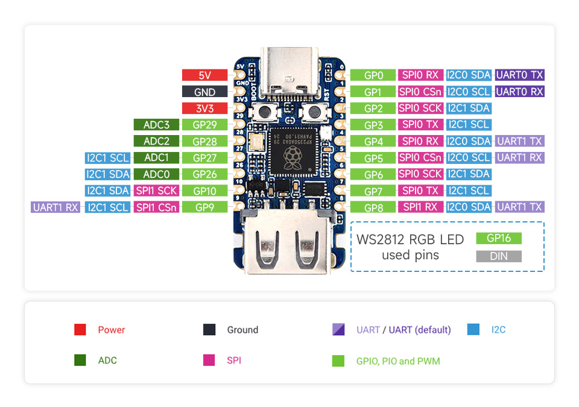

# [midi2cpp](../..) | Device MIDI 2.0
## Waveshare RP2350-USB-A

Full-spec USB MIDI 2.0 device on the **Waveshare RP2350-USB-A** (21 x 51 mm, USB-C + USB-A receptacle wired to GP12 / GP13 via PIO-USB). Headless single-file showcase of every MIDI 2.0 message category beyond MIDI 1.0. Pico SDK build, no Arduino IDE.

This recipe drives the USB-C side only as a device. The USB-A receptacle and the PIO-USB lines (GP12 / GP13) are not driven here; using the USB-A receptacle as a host requires an R13 desolder hardware modification.



> Depends on TinyUSB [PR #3571](https://github.com/hathach/tinyusb/pull/3571). Until merged, the build pulls a pinned fork via FetchContent.

## USB identity

| Field | Value |
|---|---|
| VID:PID | `cafe:4076` (development-only) |
| Product | `waveshare-RP2350-USB-A` |
| Manufacturer | `github.com/sauloverissimo` |

## Build

Requires Pico SDK 2.x (RP2350 support is in 2.0+), `arm-none-eabi-gcc` (SDK auto-selects Cortex-M33), CMake 3.14+.

```bash
cmake -B build         # first run fetches TinyUSB fork
cmake --build build -j
```

Pointing at a local TinyUSB checkout: `cmake -B build -DPICO_TINYUSB_PATH=/path/to/tinyusb`.

## Flash

Hold BOOT, plug USB-C, drag `build/waveshare-rp2350-usb-a-midi2-showcase.uf2` to the mounted RP2350 drive.

## Hardware


| Pin | Use |
|---|---|
| USB-C | MIDI 2.0 device |
| USB-A | Unused in this recipe |
| GP0 / GP1 | UART TX/RX debug print @ 115200 8N1 |
| BOOT | Hold while plugging USB-C to enter BOOTSEL |
| RST | On-board reset button |

The on-board RGB LED, the USB-A receptacle, the PIO-USB pins (GP12/GP13) and the header pads are not exercised by this device-only recipe.

## Validation

```bash
lsusb | grep cafe:4076
amidi -l
```

Plug straight into a laptop and inspect with Microsoft MIDI Services Console. Expected: `Native data format: Universal MIDI Packet`, `Protocol: Midi2`, `Name: waveshare-RP2350-USB-A`, `VID/PID: CAFE/4076`.


## Spec coverage

**Tier A** (full spec). The RP2350's 520 KB SRAM affords the complete UMP + MIDI-CI surface.

| UMP MT | Spec | Notes |
|---|---|---|
| 0x0 Utility | M2-104-UM §3 | JR heartbeat 500 ms, Delta Clockstamp |
| 0x4 MIDI 2.0 Channel Voice | M2-104-UM §7 | 32-bit CCs, Per-Note family, Note Attribute, RPN/NRPN, Relative RPN/NRPN |
| 0x5 SysEx8 | M2-104-UM §9 | raw 8-bit |
| 0xD Flex Data | M2-104-UM §10 | Tempo, Time Sig, Key Sig, Metronome, Chord Name, Start/End of Clip |
| 0xF UMP Stream | M2-104-UM §11 | full Endpoint + FB Discovery |

MIDI-CI: Discovery + Profiles (1 custom registered) + Property Exchange (3 properties: static, dynamic, subscribable) + Process Inquiry, all via the `m2ci` Appendix E convenience responder.

## Showcase

Always on while mounted: JR heartbeat (500 ms), UMP Stream + MIDI-CI Discovery responders, 1 custom Profile, 3 PE properties, Process Inquiry replies.

Per cycle (~22 s):

| Scene | Content | MIDI 2.0 only because |
|---|---|---|
| **A.** Flex Data | Tempo (120 BPM), Time Sig (4/4), Key Sig (C), Metronome, Chord Name (Cmaj7), Start of Clip | MT 0xD + 0xF |
| **B.** Per-Note | Sustained C4 with Per-Note Pitch Bend (5 Hz vibrato), Registered Per-Note Controller #7, Assignable Per-Note Controller #74, Per-Note Management Reset | Per-Note family is MIDI 2.0 only |
| **C.** Resolution | Chromatic walk C5→G#5 with 16-bit velocity ramp, 32-bit CC #74 sweep, 32-bit Pitch Bend, 32-bit Poly Pressure, 32-bit Channel Pressure | MIDI 1.0 caps at 7/14-bit |
| **D.** Program + Bank | Program Change with bank MSB/LSB in a single UMP | MIDI 1.0 needs three messages |
| **E.** RPN/NRPN | RPN 0/0, NRPN, Relative RPN (+delta), Relative NRPN (-delta) | RPN/NRPN first-class + Relative |
| **F.** Note Attribute | Note On with `attribute_type=0x03` (pitch_7_9), E4 +50 cents | Microtonal attribute |
| **G.** SysEx8 | 16 raw 8-bit bytes, no 7-bit aliasing | MT 0x5 |
| **H.** Delta Clockstamp | DCTPQ=480 + Delta Clockstamp=240 ticks | MT 0x0 utility |
| **I.** PE Notify | Broadcast `OverlayRate` change to subscribers (value increments per cycle) | Property Exchange |
| **J.** End of Clip | Sequencer End of Clip marker | MT 0xF status 0x21 |

Every scene logs to UART (GP0).

## License

MIT, inherits parent [`midi2cpp` LICENSE](../../LICENSE). Waveshare hardware reference assets under `board/` (board photo, pinout, schematic) are © Waveshare Electronics, redistributed for documentation purposes.
