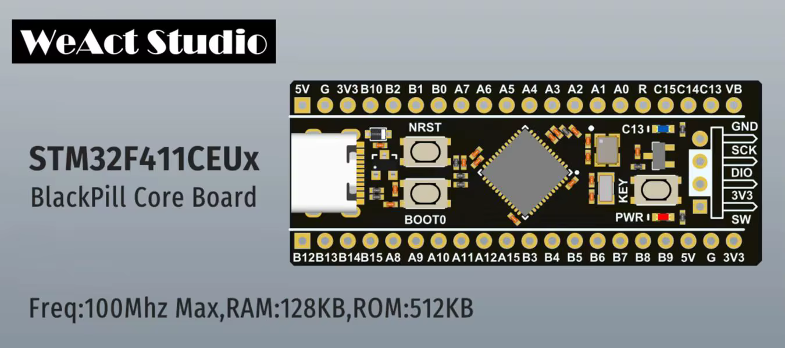
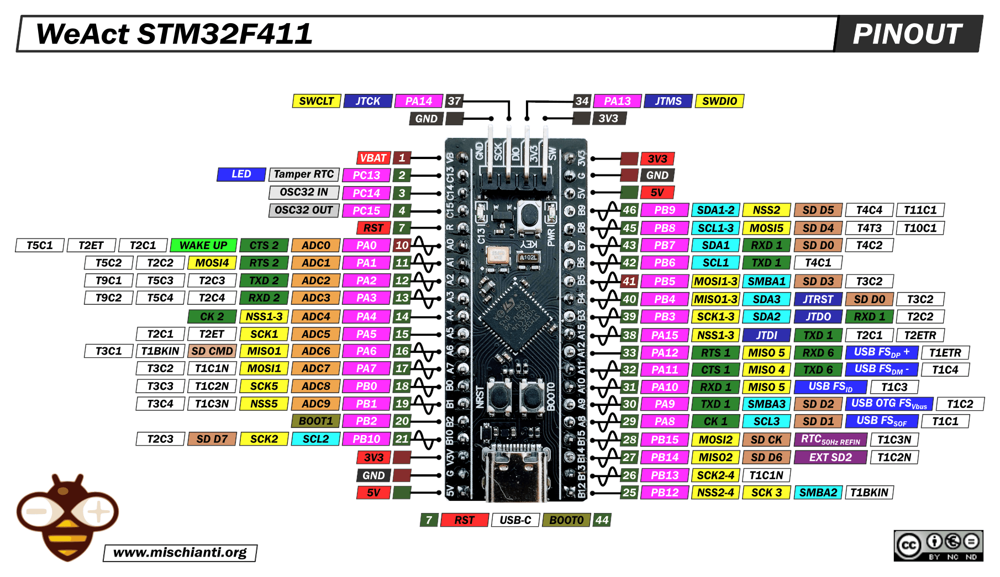

# [midi2cpp](../..) | Device MIDI 2.0
## WeAct Studio STM32F411CEU6 BlackPill

[](https://github.com/midi2-dev/MIDI2.0Workbench)

Full-surface USB MIDI 2.0 device on the **WeAct Studio STM32F411CEU6 BlackPill** (V2.0 / V3.0 core board). Headless showcase of every MIDI 2.0 message category beyond MIDI 1.0, over native OTG_FS on the USB-C connector (PA11/PA12). TinyUSB native CMake build (`family_support.cmake`) + ARM GNU toolchain, no Arduino IDE. Lives at `midi2cpp/examples/weact-STM32F411CEU6-blackpill-device-midi2/` and consumes the parent library directly (no vendoring).



## USB identity

| Field | Value |
|---|---|
| VID:PID | `cafe:40f3` (development-only) |
| USB Product (descriptor) | `WeAct BlackPill F411 MIDI 2.0` |
| Endpoint Name (host display) | `STM32F411 MIDI 2.0` |
| Manufacturer | `midi2.diy` |
| MIDI-CI | `{0x7D, 0x00, 0x00}` / Family `0x0001` / Model `0x0001` / Version `0x00010000` |

A real product MUST replace `idVendor` / `idProduct` with its own allocation (pid.codes `0x1209`, a purchased USB-IF VID, etc.).

## Build

Requires CMake 3.20+, `arm-none-eabi-gcc`, Python 3.

```bash
cmake -B build         # first run fetches TinyUSB + ST cmsis_device_f4 + stm32f4xx_hal_driver
cmake --build build -j
```

`family_support.cmake` emits `.elf`, `.bin`, `.hex`; the BlackPill has no UF2 bootloader, so flash via DFU or SWD (below). Pointing at a local TinyUSB checkout: `cmake -B build -DTINYUSB_PATH=/path/to/tinyusb`.

## Flash

Built-in system DFU bootloader (hold BOOT0, tap NRST, release BOOT0; board enumerates as `0483:df11`):

```bash
dfu-util -a 0 -s 0x08000000:leave -D build/weact-STM32F411CEU6-blackpill-device-midi2.bin
```

Or over SWD (ST-Link, or an RP2040 debugprobe / CMSIS-DAP):

```bash
openocd -f interface/cmsis-dap.cfg -f target/stm32f4x.cfg \
  -c "program build/weact-STM32F411CEU6-blackpill-device-midi2.elf verify reset exit"
```

## Hardware

USB-C is wired to OTG_FS (PA11 = D-, PA12 = D+) and works as a device out of the box; no hardware modification. VBUS sensing is disabled in the BSP, so the device runs bus-powered (no PA9 sense connection).



| Pin | Use |
|---|---|
| USB-C | USB FS device (MIDI 2.0), OTG_FS PA11/PA12 |
| PC13 | On-board LED (active-low), lit while USB is mounted |
| PA0 (KEY) | User button, free for application use |
| BOOT0 / NRST | Hold BOOT0 at reset to enter the system DFU bootloader |
| 25 MHz HSE crystal | PLL to 84 MHz SYSCLK / 48 MHz USB |

STM32F411CEU6 silicon datasheet: [STMicroelectronics](https://www.st.com/en/microcontrollers-microprocessors/stm32f411ce.html).

## Validation

```bash
lsusb | grep cafe:40f3
amidi -l                        # IO  hw:N,1,0  (bidirectional)
PORT=$(aseqdump -l | grep -i "STM32F411" | awk '{print $1}' | tr -d ':')
timeout 24 aseqdump -p ${PORT}  # captures the showcase cycle live
```

On Linux the ALSA client and UMP Endpoint Name read `STM32F411 MIDI 2.0` and the port is bidirectional (`IO`). On Windows the Microsoft MIDI Services Console shows the same Endpoint Name + MIDI 2.0 Protocol True; the Endpoint Name comes from `CFG_TUD_MIDI2_EP_NAME` (upstream auto-responder). Re-enumerate after a firmware change (Windows caches per VID:PID).

## Spec coverage

Full UMP + MIDI-CI device surface. The STM32F411CEU6 (128 KB SRAM, 512 KB flash, Cortex-M4F) carries it well under 10% of the 512 KB flash.

| UMP MT | Spec | Notes |
|---|---|---|
| 0x0 Utility | M2-104-UM §3 | JR heartbeat 500 ms, Delta Clockstamp |
| 0x3 SysEx7 | M2-104-UM §7.7 | auto-fragmented Universal Identity Reply |
| 0x5 SysEx8 + Mixed Data Set | M2-104-UM 7.8/7.10 | single stream id, single-chunk MDS |
| 0x4 MIDI 2.0 Channel Voice | M2-104-UM §7 | 32-bit CC, Per-Note family, Note Attribute, Program+Bank, RPN/NRPN, Relative RPN/NRPN, Poly + Channel Pressure, Pitch Bend |
| 0xD Flex Data | M2-104-UM §10 | Tempo, Time Sig, Key Sig, Metronome, Chord Name, Start/End of Clip |
| 0xF UMP Stream | M2-104-UM §11 | full Endpoint + FB Discovery |

MIDI-CI: Discovery + Profiles (GM 1, `7E 00 00 01 00`) + Property Exchange (5 resources: ResourceList with schema, DeviceInfo, ChannelList, ProgramList, X-OverlayRate rw+subscribable) + Process Inquiry, via the `m2ci` Appendix E responder.

Not covered: SysEx8 (MT 0x5) and full Mixed Data Set, plus multi-Group endpoint. All library-supported; left out to keep the cycle readable.

## Showcase

Always on while mounted: JR heartbeat (500 ms), UMP Stream + MIDI-CI Discovery responders, 1 Profile, 5 PE resources, Process Inquiry, PC13 LED.

Each cycle (~22 s):

| Scene | Content |
|---|---|
| A | Flex Data: Tempo (120 BPM), Time Sig (4/4), Key Sig (C), Metronome, Chord Name (Cmaj7), Start of Clip |
| B | Per-Note stack on C4: Per-Note Pitch Bend vibrato (5 Hz), Registered PNC #7 (volume), Assignable PNC #74 (brightness), Per-Note Management Reset |
| C | Resolution walk C5 to G#5: 16-bit velocity, 32-bit CC #74, 32-bit Pitch Bend, 32-bit Poly + Channel Pressure |
| D | Program Change 42 with Bank MSB 0x10 / LSB 0x05 (single UMP) |
| E | RPN 0/0, NRPN 0x12/0x34, Relative RPN, Relative NRPN |
| F | Note On with Attribute pitch_7_9 (E4 +50 cents) |
| G | SysEx7 Universal Identity Reply (auto-fragmented) |
| H | Delta Clockstamp: DCTPQ 480 + 240 ticks |
| I | Property Exchange Notify: X-OverlayRate broadcast to subscribers |
| J | End of Clip |

`aseqdump` decodes the MIDI 1.0-translatable subset (notes, CC, pressure, pitch bend, program, RPN/NRPN, SysEx). The MIDI 2.0-only messages (Flex Data, per-note controllers, Note Attribute, Delta Clockstamp) show in a UMP-native monitor such as the Microsoft MIDI Services Console.

## License

MIT, inherits the parent [`midi2cpp` LICENSE](../../LICENSE). The ST CMSIS device headers and STM32F4 HAL (fetched on demand) are BSD-3-Clause; ARM CMSIS_5 is Apache-2.0. The pinout image is by Renzo Mischianti (mischianti.org), CC BY-NC-SA.
